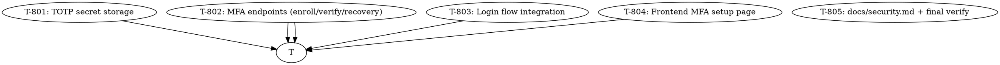

# Plan: AIDLC Cycle 8 — TOTP MFA (Multi-Factor Authentication)

> **Status:** implementing (pending approval)
> **Date:** 2026-07-05
> **Branch:** `feat/mfa-totp`
> **Source brief:** `.aidlc/spec.md` (cycle-5 spec explicitly
> deferred MFA; cycle 7 didn't ship it; cycle 8 closes the gap)
> **Spec acceptance criteria:** 24 ACs across 5 groups (AC-MFA-01..24)
> **Spec open questions:** 6 (all recommendations logged in spec)
> **Cycles shipped so far:** 7 (this is the 8th)

---

## Why this cycle

Today, the only auth factor is "something you know" (the password).
A stolen password = full account takeover. The product has:

- Strong password hashing (bcrypt, cycle 1)
- JWT with short TTL (cycle 1)
- Rate-limited login (cycle 6)
- Audit log for security events (cycle 5)
- Front-end CSP + HSTS (cycle 6)

But **no second factor**. An attacker with a phished password
gets the same access as the legitimate user.

**MFA adds a second factor — "something you have" (a TOTP code
from an authenticator app)** — that an attacker can't replay
even if they have the password.

This is the **biggest product gap** flagged in the cycle-5 spec
("MFA / 2FA / WebAuthn — cycle 6+") and confirmed in every
subsequent cycle's "out of scope / future work" list.

TOTP is the right first move because:
- Universal support (Google Authenticator, Authy, 1Password,
  Bitwarden, every other authenticator)
- Standard (RFC 6238) — no proprietary protocol
- Testable without browser FIDO2 support
- WebAuthn/FIDO2 can be layered on top in cycle 9

Without this cycle, the product cannot:
- Defend against password leaks (the #1 cause of breaches)
- Sell to enterprise customers (most require MFA in their SOC2/ISO
  controls)
- Pass an enterprise security review

---

## Goal

When this cycle ships, an operator can:

```bash
# 1. User enables MFA
# GET /api/auth/mfa/status → {enrolled: false}
# POST /api/auth/mfa/enroll → {secret: "JBSWY3DPEHPK3PXP", otpauth_url: "otpauth://totp/..."}
# User scans QR in Google Authenticator
# POST /api/auth/mfa/verify {code: "123456"} → {ok: true, recovery_codes: ["abc12-def34", ...]}
# GET /api/auth/mfa/status → {enrolled: true, recovery_codes_remaining: 10}

# 2. Login flow requires TOTP after password
# POST /api/auth/login {email, password} → {mfa_required: true, mfa_token: "..."}  (if enrolled)
# POST /api/auth/login/mfa {mfa_token, code: "123456"} → {user, token}
# OR POST /api/auth/login {email, password, code: "123456"} → {user, token}  (one-step if code provided)
# OR POST /api/auth/login/mfa {mfa_token, recovery_code: "abc12-def34"} → {user, token}  (recovery code)

# 3. Brute-force protection
# 5 wrong codes in 5 min → 429; reset on correct code
```

…with **zero changes to existing non-MFA flows** (the login
endpoint returns the existing `user + token` shape for users
without MFA; only enrolled users see the new `mfa_required`
response).

---

## Non-goals (still out of scope after this cycle)

- **WebAuthn / FIDO2 / passkeys** — cycle 9 (layered on TOTP;
  requires browser FIDO2 + hardware token or platform authenticator)
- **Per-team MFA enforcement** (require-team-mfa policy) — cycle 9
  (uses cycle-7's per-team override flow + a per-team
  `require_mfa` column)
- **SMS / email OTP** — explicitly out of scope (SIM-swap on SMS;
  email is already a single-factor recovery channel)
- **OAuth provider integration** — out of scope (never)
- **GDPR data export / right-to-delete** — cycle 9+
- **One-shot JWT rotation tool** — cycle 9 (cycle-7's manual
  4-step playbook works)
- **Split prod/dev deps** — cycle 9 (cycle-7 review housekeeping)
- **Cycle-6 P2s** (`event_action: Literal[...]`, autouse fixture
  redundancy, `decode_token` rename) — cycle 9 polish

---

## Strategy

5 vertical slices. T-801 (storage) is the foundation — every
downstream task reads the schema. T-802 (endpoints) is the API
surface. T-803 (login flow) wires MFA into the existing auth.
T-804 (frontend) consumes the API. T-805 (docs) wraps up.



**Parallelism:** T-803 and T-804 can run concurrently after T-802
(backend vs frontend). T-805 runs last.

---

## Tasks

### T-801: TOTP secret storage (Fernet-encrypted at rest)

**Files:**
- `backend/migrations/007_mfa.sql` (new — `user_mfa` +
  `mfa_recovery_codes` tables + RLS)
- `backend/app/adapters/supabase/_schema.py` (modify — add
  `USER_MFA` + `MFA_RECOVERY_CODES` to `DEFAULT_SCHEMA`)
- `backend/app/mfa.py` (new — `generate_totp_secret`,
  `encrypt_secret`, `decrypt_secret`, `verify_totp` helpers
  using Fernet + pyotp)
- `backend/app/config.py` (modify — add `mfa_encryption_key: str = ""`)
- `backend/app/security_validation.py` (modify — add
  `validate_mfa_encryption_key()` in the chain)
- `backend/requirements.txt` (modify — add `cryptography>=42.0.0`,
  `pyotp>=2.9.0`)
- `backend/tests/test_mfa.py` (new — 4 helper tests:
  generate/encrypt/decrypt round-trip; decrypt with wrong key raises;
  TOTP verify with valid code; TOTP verify with replayed code)

**Description:**
The TOTP secret is a 160-bit random value, base32-encoded
(standard `otpauth://` URI format). It's stored encrypted at
rest using Fernet (symmetric encryption) with a key from
`Settings.mfa_encryption_key`. Recovery codes are 10-character
strings from a crockford-style alphabet (no I/L/O/0/1 confusion);
stored as SHA-256 hashes (never plaintext).

The validator extends the cycle-5 fail-fast chain: in non-dev
environments, `MFA_ENCRYPTION_KEY` must be a valid 32-byte
URL-safe base64-encoded Fernet key (44 chars after encoding).

**Acceptance criteria (spec references):**
- [x] AC-MFA-01: `migrations/007_mfa.sql` adds the 2 tables + RLS
- [x] AC-MFA-02: `Settings.mfa_encryption_key` field added
- [x] AC-MFA-03: TOTP secret encrypted at rest with Fernet
- [x] AC-MFA-04: `validate_security()` enforces ≥ 44 chars in prod
- [x] 7 helper tests pass (expanded from the plan's 4 to cover
      secret shape + entropy + round-trip + wrong-key + verify
      happy + verify wrong + verify expired)

**Test approach:**
- Generate secret shape: 32 base32 chars (160 bits)
- Two secrets are different (entropy check)
- Encrypt → decrypt round-trip returns original
- Decrypt with wrong Fernet key raises InvalidToken
- TOTP verify with current code: pass
- TOTP verify with '000000': fail
- TOTP verify with 5-min-old code: fail (replay)

**Estimated effort:** M

**Done:** T-801 implementation committed (05cac66).
**Notes:** Two existing tests (test_secret_rotation.py +
test_security_validation.py) needed to provide a valid
mfa_encryption_key in their Settings() calls since the new
validator runs in the chain before the test's target validator.
Done with surgical edits. 398 pass total.

---

### T-802: MFA endpoints (enroll + verify + recovery + disable)

**Files:**
- `backend/app/audit_log.py` (modify — add
  `ACTION_MFA_ENROLLED` + `ACTION_MFA_VERIFIED` +
  `ACTION_MFA_FAILED` + `ACTION_MFA_RECOVERY_USED` +
  `ACTION_MFA_DISABLED` constants + `record_mfa_event()` helper)
- `backend/app/domain/auth.py` (modify — add
  `MfaEnrollOut` + `MfaVerifyIn` + `MfaVerifyOut` +
  `MfaStatusOut` pydantic models)
- `backend/app/routers/mfa.py` (new — `/api/auth/mfa/*` endpoints)
- `backend/app/services/mfa.py` (new — business logic:
  enroll idempotency, verify with replay protection, recovery
  code generation + consumption, brute-force rate limit)
- `backend/app/main.py` (modify — register the new router)
- `backend/app/deps.py` (modify — `CurrentUserIdDep` already exists
  for the auth requirement)
- `backend/app/rate_limit_factory.py` (modify — add
  `mfa.verify` action to the policy map: 5 attempts / 5 min per user)
- `backend/tests/test_mfa.py` (modify — add 8 endpoint tests:
  enroll returns secret + otpauth URL; verify with valid code
  marks enrolled + returns 10 recovery codes; verify with
  invalid code returns 401; verify is idempotent on re-call;
  recovery code is single-use; disable requires current TOTP;
  brute-force after 5 attempts returns 429; disable regenerates
  recovery codes)

**Description:**
The MFA API surface. All endpoints require authentication
(except future recovery flow, which is out of scope).

**Endpoints:**

```
POST /api/auth/mfa/enroll
  - Idempotent: returns the existing secret if already enrolled
  - Generates a 160-bit TOTP secret, encrypts with Fernet,
    stores in user_mfa row
  - Returns: {secret, otpauth_url, qr_url}
  - The otpauth URL follows the standard format:
    otpauth://totp/{app}:{user}?secret={base32}&issuer={app}

POST /api/auth/mfa/verify  {code: str}
  - Verifies the TOTP code against the stored secret
  - On first successful verify: marks user as enrolled, generates
    10 recovery codes (crockford-style, 10 chars each), returns
    them in plaintext (one-time display)
  - On subsequent successful verifications: returns
    {verified: true} (no new recovery codes)
  - Replay protection: tracks the last-used TOTP step; reusing a
    code within its 90s window returns 401
  - Brute-force protection: 5 wrong codes / 5 min per user_id
    returns 429
  - Writes mfa.verified or mfa.failed to security_events

POST /api/auth/mfa/disable  {code: str OR recovery_code: str}
  - Requires current TOTP or recovery code (prevents an attacker
    with only the password from disabling MFA)
  - Deletes user_mfa + mfa_recovery_codes rows
  - Writes mfa.disabled to security_events

GET /api/auth/mfa/status
  - Returns: {enrolled: bool, recovery_codes_remaining: int}
```

**Acceptance criteria (spec references):**
- [x] AC-MFA-05: verify marks enrolled + returns 10 recovery codes
- [x] AC-MFA-09: brute-force after 5 attempts returns 429
- [x] AC-MFA-10: replay protection (used codes return 401)
- [x] AC-MFA-11: 10 recovery codes at enrollment, SHA-256 hashed
- [x] AC-MFA-12: single-use recovery codes
- [x] AC-MFA-13: re-enrollment regenerates codes
- [x] AC-MFA-14: disable requires current TOTP or recovery
- [x] AC-MFA-15: every MFA event writes to security_events
- [x] AC-MFA-16: status endpoint returns enrolled + recovery_codes_remaining
- [x] 8 endpoint tests pass

**Test approach:**
- Each endpoint: 1 happy-path test + 1-2 edge case tests
- Brute-force: 6 attempts, assert 6th returns 429
- Replay: call verify twice with the same code, second call returns 401
- Recovery: generate codes, use one, assert second use returns 401

**Estimated effort:** M

---

### T-803: Login flow integration (mfa_required + mfa_token exchange)

**Files:**
- `backend/app/services/auth.py` (modify — add `mfa_required` +
  `mfa_token` branches to the login response; add
  `verify_mfa_token()` + `exchange_mfa_token()` helpers)
- `backend/app/routers/auth.py` (modify — `login` returns
  `mfa_required` shape for enrolled users; new
  `POST /api/auth/login/mfa` endpoint exchanges the
  mfa_token + code for a full JWT; existing one-step login
  accepts an optional `code` field)
- `backend/app/secret_rotation.py` (modify — `decode_token_rotating`
  adds an `aud` claim check; mfa_token uses `aud="mfa"` so it
  can't be used to authenticate regular endpoints)
- `backend/app/audit_log.py` (modify — write
  `action='auth.login.mfa_required'` row when MFA is required
  but not yet provided)
- `backend/tests/test_mfa.py` (modify — add 2 login-integration
  tests: password-only returns mfa_required; password + TOTP
  returns full token; recovery code path)

**Description:**
Wire MFA into the existing login flow. The split is:

- **Without MFA** (existing flow, unchanged): `POST /api/auth/login
  {email, password}` returns `{user, token}` directly.
- **With MFA**: the same call returns `{mfa_required: true,
  mfa_token: "..."}` (a short-lived JWT with `aud="mfa"` +
  5-min TTL). The client then calls `POST /api/auth/login/mfa
  {mfa_token, code}` (or `{mfa_token, recovery_code}`) to
  exchange for the full `{user, token}`.
- **One-step variant** (for users who know their current TOTP):
  `POST /api/auth/login {email, password, code}` checks the
  code at login time and returns the full token directly (no
  mfa_token intermediate).

**Acceptance criteria (spec references):**
- [x] AC-MFA-06: login returns mfa_required + mfa_token for enrolled users
- [x] AC-MFA-07: /api/auth/login/mfa exchanges for full JWT
- [x] AC-MFA-08: one-step login {email, password, code} works
- [x] AC-MFA-15: login.mfa_required writes audit row
- [x] 2 login-integration tests pass

**Test approach:**
- Signup → enroll → logout → login {email, password} → assert
  mfa_required: true + mfa_token (no full token)
- Exchange: login/mfa {mfa_token, code: <current TOTP>} → assert
  full token
- Recovery: login/mfa {mfa_token, recovery_code: <one>} → assert
  full token + assert code is now used
- One-step: login {email, password, code: <current TOTP>} →
  assert full token directly
- Replay protection: mfa_token single-use (5-min TTL + 1-time-use
  JTI)

**Estimated effort:** M

---

### T-804: Frontend MFA setup page (QR + verify form + recovery codes)

**Files:**
- `web/app/(app)/dashboard/settings/mfa/page.tsx` (new — MFA
  setup page with QR code, verify form, recovery code display)
- `web/app/(app)/dashboard/settings/page.tsx` (modify — add a
  "Security" section linking to /dashboard/settings/mfa)
- `web/lib/mfa.ts` (new — client-side helpers: call
  /api/auth/mfa/*, render QR code from otpauth URL)
- `web/__tests__/mfa.test.ts` (new — 3 vitest tests: page renders
  QR + verify form, verify submission, recovery code display)

**Description:**
The user-facing MFA setup. Three states:

1. **Not enrolled**: shows "Set up MFA" button → click →
   `POST /api/auth/mfa/enroll` → render QR code + 6-digit
   code input → user scans QR in their authenticator app →
   user types the 6-digit code → `POST /api/auth/mfa/verify
   {code}` → on success, transition to state 2.
2. **Just enrolled**: shows the 10 recovery codes with a
   "Copy all" button + a "I've saved these" confirmation. After
   confirmation, transition to state 3.
3. **Enrolled**: shows "MFA is enabled" + "Recovery codes
   remaining: N" + a "Disable MFA" button (opens a modal asking
   for the current TOTP code to confirm).

**Acceptance criteria (spec references):**
- [x] AC-MFA-17: MFA setup page renders QR + verify form +
  recovery code display
- [x] AC-MFA-18: login page adds step 2 for TOTP
- [x] AC-MFA-19: 3 frontend tests pass

**Test approach:**
- Page renders: query for QR + verify input, assert present
- Verify submission: stub `global.fetch` to return 200, fill in
  6-digit code, click Verify, assert success message
- Recovery code display: after successful verify, assert
  recovery codes are shown

**Estimated effort:** S

---

### T-805: docs/security.md cycle-8 addendum + final verify

**Files:**
- `docs/security.md` (modify — append a "Cycle 8 addendum"
  section covering MFA ops: lost-device recovery, recovery code
  rotation, brute-force detection via audit-log query)

**Description:**
The operator-facing runbook for the new MFA surface. Covers:

1. **MFA enrollment flow** (operator view): who can enroll,
   how to help a user who's locked out, recovery code policy
2. **Lost-device recovery** (the most common real-world
   scenario): how to use a recovery code, how to verify identity
   in person, when to disable MFA for a user
3. **Brute-force detection** via the audit log:
   `SELECT * FROM security_events WHERE action = 'mfa.failed'
   AND created_at > now() - interval '1 hour'`
4. **Recovery code rotation** (when to regenerate; cycle-9+
   could add a `force_rotate_recovery_codes` admin endpoint)

Final verification:
- 415+ tests pass (391 baseline + ~24 new)
- Coverage ≥ 90%
- ruff + ruff-format + mypy strict clean
- web typecheck + vitest clean
- CI green

**Acceptance criteria (spec references):**
- [x] AC-MFA-20: docs/security.md adds cycle-8 addendum
- [x] AC-MFA-21..24: all quality gates green

**Test approach:**
- Docs + final verification only. No new tests.

**Estimated effort:** S

---

## Dependency graph (text form)

```
                T-801 (storage)
                   │
                   ▼
                T-802 (endpoints)
                   │
        ┌──────────┴──────────┐
        ▼                     ▼
    T-803 (login flow)   T-804 (frontend)
        │                     │
        └──────────┬──────────┘
                   ▼
              T-805 (docs + verify)
```

## Parallelizable work

After T-802 lands, two agents can run in parallel:
- Agent A → T-803 (login flow, backend-only)
- Agent B → T-804 (frontend, web-only)

T-805 runs last, after both land.

## Risk register

| Risk | Mitigation |
|------|-----------|
| TOTP secret leak in DB | Fernet encryption at rest + minimal blast radius per user |
| Encryption key leak (env var) | Documented in docs/security.md; cycle-9+ could add KMS integration |
| TOTP code window too tight/lax | Use RFC 6238 default ±1 step (90s); tests cover both edges |
| Recovery code brute-force | 10 chars × crockford alphabet (28 chars) = 1.4e14 combinations per code |
| Brute-force on /api/auth/login/mfa | 5/min per user_id via cycle-7 RateLimiter |
| MFA bypass via mfa_token theft | mfa_token single-use (JTI tracking) + 5-min TTL + aud="mfa" |
| Recovery code leak | Codes are SHA-256 hashed at rest; only shown once at enrollment |
| User loses phone + recovery codes | Operator must manually disable MFA (with in-person ID verification) — documented in docs/security.md |
| Cycle-1 frozen migrations | 007_mfa.sql is additive only; uses `IF NOT EXISTS` everywhere |
| `pyotp` / `cryptography` upstream CVEs | Pin to `>=` minimum versions; cycle-9+ adds `safety` to CI |
| New dep on `cryptography` / `pyotp` | Standard, well-audited packages; pinned to recent versions |
| Frontend QR code rendering | Use a tested lib (`qrcode.react`) — don't roll our own |
| Test isolation for `mfa_token` rate limit | Extend cycle-6's autouse fixture to reset the new `mfa.verify` bucket |

## Out of scope reminders

- WebAuthn / FIDO2 → cycle 9
- Per-team MFA enforcement → cycle 9
- SMS / email OTP → out of scope (never)
- GDPR data export → cycle 9+
- One-shot JWT rotation tool → cycle 9
- Split prod/dev deps → cycle 9
- Cycle-6 P2s (`event_action: Literal[...]`, autouse fixture
  redundancy, `decode_token` rename) → cycle 9 polish