# Plan: AIDLC Cycle 4 — Per-Seat Billing + Stripe Webhooks

> **Status:** DRAFT (proposal; pending user approval)
> **Date:** 2026-07-04
> **Branch (proposed):** `feat/billing-stripe`
> **Source brief:** spec's "Out of Scope (Cycle 3)" explicitly called out
> "per-seat billing (charge per active member)". Cycle 3 gave us the
> team model; this cycle gives it a price tag.

---

## Why this cycle

The Month-1 MVP (PR #1) + cycle 2 (real adapters, PR #3) + cycle 3
(multi-tenant teams, PR #4) give us:

- A working real-estate SaaS that agents can deploy in production
- A team model where 1-5 agents share a property pool
- Cross-team isolation (mock + Supabase RLS)

What's missing: **a price tag.** Cycle 4 closes that gap by adding
the Stripe integration that turns the team model into a monetizable
SaaS. Without this cycle:

- The product cannot charge for usage
- The "team plan: starter / growth / team" column on `teams` is
  cosmetic (set on creation but never read)
- New operators have no way to upgrade to a paid plan
- The team owner cannot invite more than ~5 agents before needing
  manual billing UX

This cycle lights up the billing loop end-to-end: plan selection at
signup, Stripe Checkout for upgrades, webhook for plan changes,
member-count enforcement (per-seat limit), and an in-app Billing
page.

The pricing model:

| Plan | Members included | Monthly price (USD) | Properties | AI listings/mo |
|------|------------------|---------------------|-------------|------------------|
| `starter` | 1 | $0 (free) | 5 | 20 |
| `growth` | 3 | $29 | 25 | 200 |
| `team` | 10 | $99 | 100 | 1,000 |

`enterprise` is a follow-up (custom contract).

---

## Goal

When this cycle ships, an operator can:

```bash
# 1. Sign up → land on /pricing → click "Upgrade to Growth"
# 2. Stripe Checkout opens, returns to /dashboard/billing?upgrade=success
# 3. Webhook updates team.plan = 'growth' (mock in dev: button click)
# 4. The /api/billing/portal opens Stripe's customer portal
# 5. /api/billing/seats returns {plan, members_used, members_limit, status}
# 6. Enforce: can't invite a 4th member on the Growth plan (plan limit)
# 7. Live smoke w/ Stripe test mode (RUN_LIVE_BILLING=1) verifies
#    checkout-session creation + webhook handling
```

…with zero router code changes to existing endpoints (only the team
invitation router gets a plan-limit guard).

---

## Non-goals (still out of scope after this cycle)

- **Stripe Tax** (auto tax calculation) — manual for MVP
- **Coupons / promo codes** — Cycle 5+
- **Annual pricing** — Cycle 5+
- **Per-property billing** — flat per-seat only
- **Stripe Connect / multi-tenant payouts** — single vendor MVP
- **Plan downgrade refunds** — handled by Stripe, we just mirror status
- **Audit log UI for billing events** — Cycle 5+ (the table exists)

---

## Strategy

7 vertical slices. Foundation (T-401 to T-403) is mock-first and ships
without any external account. T-404 turns on RLS-style enforcement on
team-scoped counts. T-405 is the real Stripe wiring (httpx-based).
T-406 adds the in-app Billing page. T-407 updates tests + docs.

```dot
digraph cycle4 {
    T-401 [label="T-401: Plan schema + billing customers table"];
    T-402 [label="T-402: BillingAdapter Protocol + mock"];
    T-403 [label="T-403: /api/billing/* routes (mocked Stripe)"];
    T-404 [label="T-404: Plan-limit guard on invitations"];
    T-405 [label="T-405: Real Stripe adapter + webhook handler"];
    T-406 [label="T-406: Frontend /dashboard/billing page"];
    T-407 [label="T-407: Update test suite + docs/billing.md"];

    T-401 -> T-402;
    T-402 -> T-403;
    T-403 -> T-404;
    T-404 -> T-405;
    T-405 -> T-406;
    T-403 -> T-406;
    T-406 -> T-407;
    T-404 -> T-407;
}
```



**Parallelism:** T-403 (mock routes) and T-406 (frontend) can run in
parallel after T-402 lands. T-404 needs T-403. T-405 needs T-403.

---

## Tasks

### T-401: Plan schema + billing customers table

**Files:**
- `backend/migrations/003_billing.sql` (new — `billing_customers` table
  mapping `team_id → stripe_customer_id`, plus indexes)
- `backend/app/adapters/supabase/_schema.py` (update — add
  `BILLING_CUSTOMERS` table)
- `backend/app/adapters/supabase/mock.py` (no change — the mock handles
  any table in the schema)
- `backend/tests/adapters/test_billing_schema.py` (new — 4 tests
  covering table presence + UNIQUE on team_id)

**Description:**
The schema-mirror pattern from cycles 1+3 continues. We add one new
table:

```sql
CREATE TABLE billing_customers (
    team_id UUID PRIMARY KEY REFERENCES teams(id) ON DELETE CASCADE,
    stripe_customer_id TEXT UNIQUE,
    stripe_subscription_id TEXT,
    plan TEXT NOT NULL DEFAULT 'starter' CHECK (plan IN ('starter', 'growth', 'team', 'enterprise')),
    status TEXT NOT NULL DEFAULT 'active' CHECK (status IN ('trialing', 'active', 'past_due', 'canceled')),
    current_period_end TIMESTAMPTZ,
    cancel_at_period_end BOOLEAN DEFAULT false,
    created_at TIMESTAMPTZ DEFAULT now(),
    updated_at TIMESTAMPTZ DEFAULT now()
);
```

The `plan` field on `teams` (already there) is kept in sync with the
billing record's `plan` via the `update_team` mock method.

**Why this is the foundation:** everything else reads billing state,
so the table has to exist first.

**Acceptance criteria:**
- [ ] `migrations/003_billing.sql` declares `billing_customers`
- [ ] `BILLING_CUSTOMERS` Table added to `_schema.py`
- [ ] `test_sql_matches_mock_schema_tables` still passes
- [ ] `UNIQUE(stripe_customer_id)` enforces one-team-per-customer
- [ ] 4 new tests: insert/get/update + cross-team isolation

**Estimated effort:** S

---

### T-402: BillingAdapter Protocol + mock

**Files:**
- `backend/app/adapters/billing/base.py` (new — `BillingAdapter` Protocol
  with `create_checkout_session`, `create_portal_session`,
  `get_subscription`, `cancel_subscription`)
- `backend/app/adapters/billing/mock.py` (new — `MockBillingAdapter`
  that creates local "checkout sessions" returning a stub URL, signs
  no-op "webhooks", records every call for assertions)
- `backend/app/adapters/billing/real.py` (new — `StripeBillingAdapter`
  stub that raises `NotImplementedError` on every method)
- `backend/app/adapters/billing/factory.py` (new — `build_billing_adapter(settings)`)
- `backend/app/adapters/billing/__init__.py` (new — public re-exports)
- `backend/tests/adapters/test_real_billing.py` (new — Protocol compliance)
- `backend/tests/adapters/test_mock_billing.py` (new — 6 tests covering
  checkout creation, portal session, idempotency, error mapping)

**Description:**
Just like the email / LINE / Supabase adapters, we add a
`BillingAdapter` Protocol so the rest of the app never imports a
specific SDK. The mock-first approach means:

- Mock records every `create_*` call in-memory
- Mock returns `https://billing-mock.example.com/checkout/{token}` URLs
- Real adapter is a thin httpx wrapper around the Stripe SDK (in
  T-405); it raises NotImplementedError until then.

**Why this is separate from T-403:** the adapter is the dependency
that the routes call into. Building it in isolation means the routes
can be tested without the implementation.

**Acceptance criteria:**
- [ ] `BillingAdapter` Protocol with 4 methods
- [ ] `MockBillingAdapter` records all calls + returns stub URLs
- [ ] `StripeBillingAdapter` raises NotImplementedError
- [ ] `build_billing_adapter(settings)` returns mock when `use_mocks=true`
- [ ] 6 mock tests + 1 Protocol compliance test
- [ ] 80% coverage maintained

**Estimated effort:** S

---

### T-403: /api/billing/* routes (mocked Stripe)

**Files:**
- `backend/app/domain/billing.py` (new — `CheckoutRequest`, `BillingSessionOut`,
  `BillingStatusOut`, `PlanInfo` DTOs)
- `backend/app/services/billing_service.py` (new — `start_checkout`,
  `handle_webhook_event`, `sync_subscription_status` — mock-aware,
  records every Stripe call)
- `backend/app/routers/billing.py` (new — `GET /api/billing/status`,
  `POST /api/billing/checkout`, `POST /api/billing/portal`,
  `POST /api/billing/webhook`)
- `backend/app/main.py` (update — register billing router)
- `backend/app/deps.py` (update — `BillingDep`)
- `backend/tests/test_billing.py` (new — 7 tests covering status,
  checkout session creation, portal session, webhook signature
  verification, plan sync)

**Description:**
The routes:
- `GET /api/billing/status` — returns `{plan, status, seats_used,
  seats_limit, period_end, ...}` for the caller's team
- `POST /api/billing/checkout` — creates a Stripe Checkout session +
  returns `{url, session_id}` (mock in dev: returns a stub URL)
- `POST /api/billing/portal` — creates a Stripe Customer Portal session
- `POST /api/billing/webhook` — verifies Stripe signature, dispatches
  events (in dev: no signature check, just stores the event in mock)

**Webhook events handled:**
- `checkout.session.completed` → upgrade team plan
- `customer.subscription.created` → mark team as subscribed
- `customer.subscription.updated` → sync plan / status
- `customer.subscription.deleted` → revert to starter
- `invoice.payment_failed` → set status=`past_due`, send email

**Why mocking the webhook is safe:** the real Stripe webhook flow
is identical to the mock — the only difference is the SDK call. Tests
use the same code path; only the SDK changes.

**Acceptance criteria:**
- [ ] `GET /api/billing/status` returns team plan + seat counts
- [ ] `POST /api/billing/checkout` returns `{url, session_id}`
- [ ] `POST /api/billing/portal` returns `{url, session_id}`
- [ ] `POST /api/billing/webhook` verifies HMAC-SHA256 signature in
  real mode (Stripe Webhook Signing Secret); in mock mode accepts
  any payload (signed dev payloads are accepted for testing)
- [ ] Plan state survives across requests (mock state is in-memory)
- [ ] 7 tests cover all routes

**Estimated effort:** M

---

### T-404: Plan-limit guard on invitations

**Files:**
- `backend/app/services/plan_limits.py` (new — `get_seat_limit(plan)`,
  `assert_can_invite(team)` raises `PlanLimitExceeded`)
- `backend/app/routers/teams.py` (update — invitation endpoint enforces
  seat limit; `403 PlanLimitExceeded` if over)
- `backend/tests/test_team_members.py` (update — add 2 tests:
  free plan limit + upgrade after Stripe completes)
- `backend/tests/test_billing.py` (new test — plan-limit guard fires
  on the right plan)

**Description:**
Wire the billing state into the existing invitation flow. The
`assert_can_invite` check is called inside `invite_member` AFTER the
"already a member" check but BEFORE the email send:

```python
def invite_member(team_id, payload, user_id, supabase, email_svc):
    if not user_is_member:  # cycle 3
        raise 403
    if user_already_member:  # cycle 3
        raise 409
    from app.services.plan_limits import assert_can_invite
    assert_can_invite(supabase, team_id)  # NEW (T-404)
    ...
```

**Why a separate task:** this is the "billing affects product
behavior" hook. Once this lands, inviting more members than the plan
allows becomes a 403 (instead of silently creating a team that
overruns the plan).

**Acceptance criteria:**
- [ ] Starter plan: 1 member only (inviting the 2nd fails with 403)
- [ ] Growth plan: 3 members allowed
- [ ] Team plan: 10 members allowed
- [ ] Plan upgrade via webhook immediately raises the limit
- [ ] Plan downgrade doesn't revoke existing memberships (just blocks
  new ones until under the limit)

**Estimated effort:** S

---

### T-405: Real Stripe adapter + webhook handler

**Files:**
- `backend/app/adapters/billing/real.py` (update — `StripeBillingAdapter`
  implements all 4 methods using `stripe` Python SDK)
- `backend/requirements.txt` (update — add `stripe==11.3.0`)
- `backend/.env.example` (update — add `STRIPE_API_KEY`,
  `STRIPE_WEBHOOK_SECRET`, `STRIPE_PRICE_*`)
- `backend/tests/test_live_smoke.py` (update — add 1 live test for
  real Stripe sandbox: create checkout session, verify URL format)
- `backend/app/routers/billing.py` (update — in real mode, verify
  webhook HMAC signature; in mock mode, accept unsigned payloads)

**Description:**
This is the production wiring. The real `StripeBillingAdapter`:
- Uses `stripe.checkout.Session.create(...)` for `create_checkout_session`
- Uses `stripe.billing_portal.Session.create(...)` for `create_portal_session`
- Uses `stripe.Subscription.retrieve(...)` for `get_subscription`
- Uses `stripe.Subscription.modify(..., cancel_at_period_end=True)` for cancel

Webhook handler in real mode:
- Verifies `Stripe-Signature` header against `STRIPE_WEBHOOK_SECRET` using
  `stripe.Webhook.construct_event(payload, sig, secret)`
- Returns 200 on success, 400 on bad signature, 500 on handler error

**Why this is separate:** real Stripe integration requires a Stripe
account (live or test). The cycle 1-4 strategy is mock-first; the
real wiring can land without disrupting the test suite.

**Acceptance criteria:**
- [ ] Real adapter methods call Stripe SDK correctly
- [ ] Webhook handler verifies Stripe HMAC signature
- [ ] Test for `stripe.checkout.Session.create()` shape (MockTransport
  against the SDK's underlying httpx client if possible)
- [ ] Live smoke test creates a real Checkout session in Stripe test
  mode (RUN_LIVE_BILLING=1)
- [ ] CI stays green without Stripe keys

**Estimated effort:** L (split into T-405a Stripe SDK wiring, T-405b webhook handler)

---

### T-406: Frontend /dashboard/billing page

**Files:**
- `web/lib/billing.ts` (new — typed API client wrapping the 4 endpoints)
- `web/app/(app)/dashboard/billing/page.tsx` (new — pricing card,
  current plan badge, "Manage billing" button → Stripe portal,
  "Upgrade" CTA → plan picker)
- `web/components/billing/PricingCard.tsx` (new — single plan card)
- `web/components/billing/PlanPicker.tsx` (new — 3-plan toggle with
  monthly USD prices)
- `web/components/billing/UpgradeSuccessToast.tsx` (new — toast on
  `?upgrade=success` query param)
- `web/app/(app)/dashboard/leads/page.tsx` (update — header shows
  plan badge)
- `web/lib/api.ts` (update — adds BillingPlan enum + team plan helpers)

**Description:**
The billing page renders:
- Current plan card (with seat usage: "2 / 3 members")
- 3-plan toggle → click → opens Stripe Checkout (or stub in mock)
- "Manage billing" → opens Stripe Customer Portal
- Webhook-success toast on `?upgrade=success`

Empty state: free plan (defaults), shows "Upgrade" CTA only.
Loading state: skeleton + "Loading billing..."

**Acceptance criteria:**
- [ ] Page renders 3 pricing cards with correct monthly USD prices
- [ ] Current plan highlighted
- [ ] "Upgrade" CTA opens Stripe Checkout (or stub URL in mock)
- [ ] "Manage billing" opens Stripe portal
- [ ] Plan badge in dashboard header shows current plan
- [ ] Webhook success toast on return from Stripe
- [ ] Vitest render + interaction tests pass

**Estimated effort:** M

---

### T-407: Update test suite + docs/billing.md

**Files:**
- `backend/tests/conftest.py` (update — autouse reset of billing mock cache)
- `backend/tests/test_billing.py` (update — add 2 tests:
  plan-upgrade-via-webhook updates state, plan-limit guard respects
  growth → team upgrade)
- `backend/tests/test_live_smoke.py` (update — add Stripe sandbox test)
- `docs/billing.md` (new — user-facing doc: how billing works, how
  to upgrade, how to handle failed payments, how to cancel)

**Description:**
The cycle 4 test suite update + docs. The billing doc explains:

- Plan tiers (starter / growth / team) + limits
- Per-seat billing model
- How the upgrade flow works (Checkout → webhook → team.plan updated)
- What happens on payment failure (status=`past_due`, email sent,
  team can still log in but can't invite new members)
- How to cancel (Stripe portal; status → `canceled` at period end)
- How to switch from Stripe to manual billing (Cycle 5+ feature)

**Acceptance criteria:**
- [ ] All cycle-1+2+3 tests still pass (no regressions)
- [ ] Cycle-4 tests add ≥ 25 new (across T-401..T-406)
- [ ] docs/billing.md explains plans, limits, payment failure, cancel
- [ ] Coverage stays ≥ 80%
- [ ] CI green without Stripe keys

**Estimated effort:** M

---

## Risk register

| Risk | Likelihood | Impact | Mitigation |
|------|------------|--------|------------|
| Stripe API costs (test mode is free) | L | M | Live smoke test uses Stripe **test mode** (no real charges). CI never hits Stripe. |
| Webhook signature verification races | M | M | T-405 includes both happy-path (valid sig → 200) and bad-sig (401) tests. |
| Plan-limit guard could lock out existing users on downgrade | L | H | Downgrade applies to NEW invites only; existing memberships are kept. Tested explicitly. |
| Mock-first pattern divergence (mock accepts unsigned webhooks, real requires Stripe sig) | M | M | Both paths use the same handler code; only the verification flag differs. Tested both. |
| Stripe SDK pinning (breaking changes between minor versions) | M | M | Pin `stripe==11.3.0`; document upgrade process in runbook. |
| Billing state drift between mock + real | L | M | Same `billing_customers` table schema for both; mock implements the same methods. |
| Cycle 4 is too big | M | M | T-405 split into T-405a (Stripe SDK) + T-405b (webhook). T-407 is just docs. |

---

## Out of scope (deferred to Cycle 5+)

- Stripe Tax / promo codes / annual pricing
- Per-property billing (we ship per-seat only)
- Stripe Connect (multi-tenant payouts)
- Plan downgrade refunds (Stripe handles, we just mirror status)
- Audit log UI for billing events (the `audit_logs` table already exists)
- Real-time quota metering (current = count on invite, not usage)
- Self-service plan picker upgrades (only via Stripe Checkout for now)
- Multi-currency support (USD only)

---

## Coverage + quality bar (unchanged)

- `pytest -q --cov=app --cov-fail-under=80` (real adapters excluded
  from coverage as before)
- `ruff + ruff format --check` clean
- `mypy app/` strict, 0 errors
- Frontend: `npm run lint + typecheck + vitest` clean

---

## Estimated total effort

| Task | Effort |
|------|--------|
| T-401 | S |
| T-402 | S |
| T-403 | M |
| T-404 | S |
| T-405 | L (split) |
| T-406 | M |
| T-407 | M |
| **Total** | **~7–10 days of focused work** |

---

_Updated: 2026-07-04T04:55:00Z — Cycle 4 plan drafted, pending user approval._
