# Plan: AIDLC Cycle 3 — Multi-Tenant Teams with RLS

> **Status:** DRAFT (proposal; pending user approval)
> **Date:** 2026-07-04
> **Branch (proposed):** `feat/multi-tenant-teams`
> **Source brief:** spec's "Out of Scope (Month 1)" + spec's "Out of Scope
> (Cycle 2)" — multi-tenant teams / RLS policies was deferred to Cycle 3+
> and is the foundation for billing, audit, and analytics in later cycles.
> **Schema state:** `migrations/001_init.sql` already has the `teams`
> table and `team_id` columns on `users`/`properties`/`leads`/
> `appointments`/`contracts` — the bones are in place; the wiring is not.

---

## Why this cycle

The Month-1 MVP + cycle-2 real-adapter wiring assume **single-tenant
user-scoping**: every property/lead/message is owned by a single user.
This is fine for a solo agent but blocks the SaaS from scaling past
one user per account. The schema already includes `teams` and
`team_id` columns, but no router or adapter actually uses them.

Without this cycle, the product cannot:
- Onboard a small team (2-5 agents) sharing a property pool
- Attribute a LINE conversation to "the team" rather than one user
- Charge per-seat (Cycle 4+)
- Show "my team's listings" or "team-wide dashboard"
- Pass an enterprise security review (no tenant isolation)

This cycle lights up multi-tenant teams end-to-end: schema migration +
mock + real Supabase RLS + backend services + routers + frontend.

---

## Goal

When this cycle ships, an agent can:

```bash
# 1. Create a team
curl -X POST /api/teams -H "Authorization: Bearer $TOK" -d '{"name":"Smith Realty"}'
# → {"id":"...","name":"Smith Realty","plan":"starter","owner_id":"..."}

# 2. Invite a teammate by email
curl -X POST /api/teams/$TEAM_ID/invitations -H "..." -d '{"email":"alice@x.com","role":"agent"}'
# → {"invitation_token":"...","expires_at":"..."}

# 3. Alice accepts (creates user if new)
curl -X POST /api/teams/invitations/$TOKEN/accept -H "..."
# → {"access_token":"...","team_id":"..."}

# 4. Either user can now see team-scoped properties/leads
curl -X GET /api/properties -H "Authorization: Bearer $ALICE_TOK"
# → [{"title":"Smith Realty Team's condo",...}, ...]   # team-scoped, not user-scoped
```

…with cross-team isolation enforced:
- Mock: via application-level `team_id` filter (no RLS)
- Real Supabase: via RLS policies in `migrations/002_rls.sql` (DB-enforced)
- The same backend code path works in both modes.

---

## Non-goals (still out of scope after this cycle)

- **Per-seat billing** (charge per active member) — Cycle 4+
- **Audit log UI** (who changed what when) — Cycle 4+
- **Granular roles** (per-resource ACL like "can edit but not delete")
- **Team-scoped LINE OA** (currently one LINE channel per agent;
  multi-tenant would mean one channel per team) — Cycle 5+
- **Cross-team data sharing** (deals between teams) — not in roadmap
- **Team-departures + handover** (reassign properties to a new owner)
  — Cycle 4+

These remain candidates for **Cycle 4+**.

---

## Strategy

8 vertical slices. Foundation (T-301 to T-303) lays the schema and
membership model. T-304 re-scopes existing routers. T-305 turns on RLS
on real Supabase. T-306/T-307 are the UI + invite flow. T-308 updates
the existing test suite + adds RLS smoke tests.

```dot
digraph cycle3 {
    T-301 [label="T-301: Schema migration + mock team scoping"];
    T-302 [label="T-302: Team CRUD + membership routes"];
    T-303 [label="T-303: Member management (role + remove + leave)"];
    T-304 [label="T-304: Re-scope existing routers by team_id"];
    T-305 [label="T-305: Supabase RLS policies + live smoke"];
    T-306 [label="T-306: Frontend team settings page + invite UI"];
    T-307 [label="T-307: Invite email mock + accept flow"];
    T-308 [label="T-308: Update test suite + RLS smoke tests"];

    T-301 -> T-302;
    T-301 -> T-304;
    T-302 -> T-303;
    T-302 -> T-304;
    T-304 -> T-305;
    T-305 -> T-306;
    T-302 -> T-307;
    T-307 -> T-306;
    T-306 -> T-308;
    T-304 -> T-308;
}
```



**Parallelism:** T-303 + T-304 can run in parallel after T-302. T-307
can run in parallel with T-306 once T-302 lands.

---

## Tasks

### T-301: Schema migration + mock team scoping

**Files:**
- `backend/migrations/002_teams.sql` (new — adds `team_memberships` table,
  updates `teams` with `plan` + timestamps, adds RLS-enabling placeholders)
- `backend/app/adapters/supabase/_schema.py` (update — add TEAM_MEMBERSHIPS table)
- `backend/app/adapters/supabase/mock.py` (update — add `team_memberships`
  storage + add `team_id` scoping on every query helper)
- `backend/tests/adapters/test_mock_supabase.py` (update — tests for
  `team_memberships` table + scoped queries)
- `backend/migrations/002_rls.sql` (new — Supabase RLS policies; T-305
  will exercise them against a live project)

**Description:**
The `teams` table already exists from cycle 1. This task adds:
1. `team_memberships` table — explicit join with `role` per member
   (separate from `users.team_id` which becomes a derived/default field)
2. Mock: stores team_memberships rows + scopes every `list_*` /
   `get_*` method by `team_id` (currently they're all user-scoped)
3. Migration files mirror each other (mock + real) so the schema is
   consistent.

**Why this is the foundation:** the rest of the cycle depends on
`team_id` being queryable + team membership being enforced.

**Acceptance criteria:**
- [ ] `migrations/002_teams.sql` declares `team_memberships` with
  `(team_id, user_id, role, joined_at)` and a composite PK
- [ ] Mock `team_memberships` is queryable: list by team, list by user,
  add/remove members
- [ ] Every mock `list_*` / `get_*` now filters by `team_id` (with
  `user_id` as fallback for backwards compat — see T-304 for the cutover)
- [ ] Tests: 8+ new tests covering team_memberships CRUD + scoped queries

**Estimated effort:** M (split into T-301a schema, T-301b mock scoping)

---

### T-302: Team CRUD + membership routes

**Files:**
- `backend/app/domain/team.py` (new — DTOs: TeamCreate, TeamOut,
  TeamMemberOut, InvitationCreate, InvitationOut, InvitationAccept)
- `backend/app/routers/teams.py` (new — POST /api/teams, GET /api/teams/me,
  GET /api/teams/{id}, GET /api/teams/{id}/members)
- `backend/app/services/team_service.py` (new — create_team, get_user_team,
  list_members, invite_member)
- `backend/app/main.py` (update — registers teams router)
- `backend/tests/test_teams.py` (new — ST-T-302 tests)

**Description:**
Backend service + router for the team lifecycle. The first user
who calls `POST /api/teams` becomes the team `owner`. Subsequent
users join via invitations (T-307). Members have roles: `owner`,
`admin`, `agent` — used by T-303 to gate role changes.

**Acceptance criteria:**
- [ ] ST-T-302a: `POST /api/teams` creates team, sets caller as owner
- [ ] ST-T-302b: `GET /api/teams/me` returns caller's team(s)
- [ ] ST-T-302c: `GET /api/teams/{id}/members` returns all members + roles
- [ ] ST-T-302d: 401 on unauthenticated access; 404 on team not found
  (or user not a member — pick one and document)
- [ ] The `plan` field is set to 'starter' on creation; future billing
  cycle can upgrade it
- [ ] All endpoints require authentication (existing `get_current_user`)

**Estimated effort:** M

---

### T-303: Member management (role change + remove + leave)

**Files:**
- `backend/app/routers/teams.py` (update — add PATCH/DELETE /api/teams/{id}/members/{user_id},
  POST /api/teams/{id}/leave)
- `backend/app/services/team_service.py` (update — change_role, remove_member)
- `backend/tests/test_teams.py` (update — member management tests)

**Description:**
Owners/admins can change member roles and remove members. Members can
leave voluntarily. Critical invariant: an owner cannot demote or
remove themselves (to prevent the team from becoming ownerless);
they must transfer ownership first (Cycle 4+) or delete the team.

**Acceptance criteria:**
- [ ] ST-T-303a: `PATCH .../members/{user_id}` changes role (owner only)
- [ ] ST-T-303b: `DELETE .../members/{user_id}` removes (owner only,
  except for self)
- [ ] ST-T-303c: `POST /api/teams/{id}/leave` self-removes (owner
  cannot leave — must delete team or transfer ownership)
- [ ] ST-T-303d: Only `owner` role can change/remove others
- [ ] ST-T-303e: `admin` can remove `agent` (not other admins or
  owner); cannot change roles
- [ ] Audit trail: `team_memberships.left_at` + `removed_by` recorded

**Estimated effort:** S/M

---

### T-304: Re-scope existing routers by `team_id`

**Files:**
- `backend/app/routers/properties.py` (update — filter by team_id)
- `backend/app/routers/leads.py` (update — filter by team_id)
- `backend/app/routers/messages.py` (update — filter by team_id)
- `backend/app/routers/ai.py` (update — listings scoped by team_id)
- `backend/app/deps.py` (update — `get_current_team()` dependency
  that returns the caller's active team_id, raising 403 if no team)
- `backend/tests/test_properties.py` (update — team-scoped tests)
- `backend/tests/test_leads.py` (update)
- `backend/tests/test_ai_generator.py` (update)
- `backend/tests/test_dashboard.py` (update)
- `backend/tests/test_line_webhook.py` (update — webhook attributes
  to the team, not the single agent)

**Description:**
This is the cutover: replace `user_id`-scoped queries with
`team_id`-scoped queries. Every router endpoint that currently does
`db.query("properties", filters={"user_id": current_user["id"]})` now
does `db.query("properties", filters={"team_id": current_team_id})`.

The `_resolve_owner` function in `line_webhook.py` (which currently
finds "the first active user") now finds "the first active user in
the team that owns this LINE OA". For MVP single-tenant-per-LINE-OA
that's a lookup via env (`LINE_DEFAULT_TEAM_ID`).

**Acceptance criteria:**
- [ ] ST-T-304a: User in team X can list team X's properties
- [ ] ST-T-304b: User in team X CANNOT see team Y's properties (404
  or empty list — pick one)
- [ ] ST-T-304c: Cross-user within same team: Alice can see Bob's
  properties (shared pool)
- [ ] ST-T-304d: Webhook creates Lead + Message in the correct team
- [ ] ST-T-304e: All 184 existing tests adapted to team-scoping —
  no test should rely on cross-user isolation
- [ ] `get_current_team` dep raises 403 if user has no team yet

**Estimated effort:** L (8+ routers, 6+ test files)

---

### T-305: Supabase RLS policies + live smoke

**Files:**
- `backend/migrations/002_rls.sql` (update — actual RLS policy DDL;
  already declared in T-301 schema stub)
- `backend/tests/test_rls_policies.py` (new — assertions on policy
  existence via PostgREST introspection)
- `backend/tests/test_live_smoke.py` (update — add team-isolation
  live smoke test)

**Description:**
Apply Supabase RLS to `properties`, `leads`, `messages`,
`generated_listings` so cross-team access is denied at the DB level
(not just the app level). Mock adapter does NOT need RLS — it
simulates RLS behavior in code via `team_id` filters.

The RLS policy shape:
```sql
CREATE POLICY team_isolation ON properties
  USING (team_id = (SELECT team_id FROM users WHERE id = auth.uid()));
ALTER TABLE properties ENABLE ROW LEVEL SECURITY;
-- Same for leads, messages, generated_listings
```

**Acceptance criteria:**
- [ ] ST-T-305a: `migrations/002_rls.sql` declares policies for
  properties/leads/messages/generated_listings
- [ ] ST-T-305b: Mock + real adapter BOTH enforce team isolation
  (mock via code filter; real via RLS)
- [ ] ST-T-305c: Live smoke test: with real Supabase, RLS denies
  cross-team access (verify by inserting 2 teams + users,
  attempting cross-team read, expecting 0 rows)
- [ ] RLS test runs only on `RUN_LIVE_SMOKE=1` (PostgREST policy
  introspection needs a real project)

**Estimated effort:** M

---

### T-306: Frontend team settings page + invite UI

**Files:**
- `web/app/(app)/dashboard/team/page.tsx` (new — team name, plan,
  members list with role dropdowns)
- `web/components/team/InviteMemberModal.tsx` (new — email input +
  role selector)
- `web/components/team/MemberRow.tsx` (new — avatar + name + role
  dropdown + remove button)
- `web/lib/team.ts` (new — typed API client for team endpoints)
- `web/lib/api.ts` (update — adds team DTOs + endpoints)
- `web/__tests__/team.test.tsx` (new — vitest render + interaction)
- `web/app/(app)/dashboard/page.tsx` (update — shows team name in
  header now)

**Description:**
A new `/dashboard/team` page where the owner can see the team roster,
invite new members by email, change roles, and remove members. The
header on every page now shows the team name (replacing the
"single agent" framing).

**Acceptance criteria:**
- [ ] ST-T-306a: Page renders team name + plan + members list
- [ ] ST-T-306b: "Invite member" button opens modal; submitting
  posts to `/api/teams/{id}/invitations`
- [ ] ST-T-306c: Member row has role dropdown (disabled if not owner)
- [ ] ST-T-306d: Member row has remove button (disabled for self)
- [ ] ST-T-306e: Vitest covers render + invite flow + role change
- [ ] Vitest + lint + typecheck clean

**Estimated effort:** M

---

### T-307: Invite email mock + accept flow

**Files:**
- `backend/app/services/invitation_service.py` (new — generate_token,
  send_invite_email, accept_invite)
- `backend/app/routers/teams.py` (update — POST /api/teams/invitations/
  {token}/accept)
- `backend/app/adapters/email/base.py` (new — EmailAdapter Protocol)
- `backend/app/adapters/email/mock.py` (new — logs to console)
- `backend/app/adapters/email/factory.py` (new — factory)
- `backend/app/config.py` (update — `frontend_url` for invite link)
- `backend/tests/test_invitations.py` (new — token generation + accept
  + expiry)

**Description:**
The invite flow needs an email-sending adapter (mock for dev, real
for prod via Resend / SendGrid / SES in Cycle 4+). The accept flow
validates the token, creates the user if they don't exist, adds them
to the team, and returns a JWT.

**Why a separate task:** the email adapter is a new integration that
should be tested in isolation before being wired to teams.

**Acceptance criteria:**
- [ ] ST-T-307a: Invite token is a secure random URL-safe string
  (32+ bytes entropy)
- [ ] ST-T-307b: Token expires after 7 days (configurable)
- [ ] ST-T-307c: Mock `EmailAdapter.send()` logs the invite link to
  the dev console; the link is `{frontend_url}/invite/{token}`
- [ ] ST-T-307d: `POST /api/teams/invitations/{token}/accept`:
  - Valid + unexpired → create user (if email doesn't exist) + add
    to team + return JWT
  - Invalid or expired → 400
  - Already accepted → 410 Gone
- [ ] ST-T-307e: User who accepts the invite is auto-logged-in
  (returns the same shape as signup/login)

**Estimated effort:** M

---

### T-308: Update test suite + RLS smoke tests

**Files:**
- All existing `tests/test_*.py` (update — adapt to team-scoping)
- `backend/tests/test_rls_smoke.py` (new — RUN_LIVE_SMOKE=1 only)
- `docs/teams.md` (new — user-facing doc: how to invite teammates,
  how teams work, what RLS guarantees)

**Description:**
The bulk of this task is updating the existing test suite to use
team-scoping (T-304 cutover). Adds one live-smoke test that verifies
RLS works on a real Supabase project.

**Acceptance criteria:**
- [ ] All 230 existing tests pass with the team-scoping refactor
- [ ] RLS smoke test creates 2 teams + 2 users + 1 property in
  each, attempts cross-team read, asserts 0 rows visible
- [ ] `docs/teams.md` explains: how to create a team, invite a member,
  accept an invite, change roles, what the security model is
- [ ] Coverage stays ≥ 80%

**Estimated effort:** M

---

## Risk register

| Risk | Likelihood | Impact | Mitigation |
|------|------------|--------|------------|
| RLS migration on existing data | M | H | Migration is additive (adds table, doesn't modify existing rows); user_id-scoped data continues to work for users with no team_id |
| Breaking change to existing routers | H | M | All 184 existing tests will fail on first cutover; T-304 budgeted L to fix them in one pass |
| Webhook team attribution | M | M | For MVP, single LINE OA per team (one-to-one); multi-OA-per-team is Cycle 5+ |
| Email deliverability | L | L | Mock for now; real Resend/SendGrid integration in Cycle 4 |
| Owner can't leave team | M | L | Document the workaround (delete team or transfer ownership); auto-transfer on delete in Cycle 4 |
| RLS performance | L | M | Index on `team_id` already exists in 001_init.sql; if slow, add `USING (team_id = ...)` to use the index |

---

## Out of scope (deferred to Cycle 4+)

- **Per-seat billing** (charge per active member)
- **Audit log UI** (who changed what when — schema exists in
  `001_init.sql` as `audit_logs`)
- **Granular roles** (per-resource ACL like "can edit but not delete")
- **Team-scoped LINE OA** (one channel per team, not per agent)
- **Team ownership transfer** (hand over to another member)
- **Real email service** (Resend / SendGrid / SES)
- **Team deletion** (cascade archive + reassign)
- **Production-grade observability** (Sentry, OpenTelemetry)
- **CRM analytics** (conversion funnels per team)
- **i18n beyond Thai + English**
- **Mobile app, native LINE Flex Messages**
- **Contract generation / e-signature / PDF export**
- **Google Calendar two-way sync**

---

## Coverage + quality bar (unchanged)

- `pytest -q --cov=app --cov-fail-under=80` (real adapters excluded
  from coverage as before)
- `ruff check + ruff format --check` clean
- `mypy app/` strict, 0 errors
- Frontend: `npm run lint + typecheck + vitest` clean

---

## Estimated total effort

| Task | Effort |
|------|--------|
| T-301 | M |
| T-302 | M |
| T-303 | S/M |
| T-304 | L (8+ routers, 6+ test files — biggest task) |
| T-305 | M |
| T-306 | M |
| T-307 | M |
| T-308 | M |
| **Total** | **~7–10 days of focused work** |

---

_Updated: 2026-07-04T01:20:00Z — Cycle 3 plan drafted, pending user approval._
