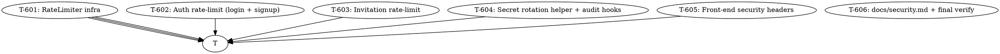

# Plan: AIDLC Cycle 6 — Rate Limiting, Secret Rotation, Front-End Headers

> **Status:** implementing (pending approval)
> **Date:** 2026-07-04
> **Branch:** `feat/rate-limiting`
> **Source brief:** `.aidlc/spec.md` (cycle 5 out-of-scope items:
> rate limiting + secret rotation tooling + front-end CSP/HSTS)
> **Spec acceptance criteria:** 21 ACs across 4 groups
> **Spec open questions:** 5 (all recommendations logged in spec)
> **Cycle-5 carry-over:** T-505 (docs/security.md) folded into T-606

---

## Why this cycle

Cycle 4 (billing) and cycle 5 (security hardening) closed the
biggest footguns: insecure defaults silently shipped to production,
no audit trail for security events, RLS write-path gaps. What's
left are **operational** security gaps that block true
prod-readiness:

1. **Login is brute-forceable.** Cycle 5 even added an audit
   log so we'd *see* the brute-force attempts, but a real
   mitigation is to *stop* them. The `# TODO(security)` comment
   in `routers/auth.py:71-72` is the smell.
2. **JWT secret rotation isn't possible without logging every user
   out.** Cycle 5 made the validator strict (≥32 bytes, not the
   default), but on rotation day there's no good way to deploy
   a new secret — operators either accept the downtime or skip
   rotation entirely.
3. **Front-end ships without security headers.** Next.js's default
   config has no CSP, no HSTS, no X-Frame-Options. A deployed
   instance is missing the baseline headers every modern browser
   expects.

Without this cycle, the product cannot:
- Defend against credential stuffing on /api/auth/login
- Rotate JWT_SECRET on a regular schedule (PCI-DSS / SOC2 controls)
- Pass an enterprise security review (no CSP/HSTS = automatic fail)
- Ship audit-driven alerting (rate-limit-exceeded events are
  needed to drive ops dashboards)

This cycle closes all three. Rate limiting is the foundation;
secret rotation is the ops tooling; front-end headers are the
last-mile hardening; docs are the operator-facing runbook.

---

## Goal

When this cycle ships, an operator can:

```bash
# 1. Login is brute-force-protected
for i in {1..20}; do
    curl -X POST /api/auth/login \
        -d '{"email":"x@y.com","password":"wrong"}'
done
# → first 5 attempts return 401 (bad creds)
# → 6th-20th return 429 with Retry-After: <seconds>
# → security_events captures each rejection

# 2. JWT secret rotation works without logging users out
#    (deploy with both secrets for the rollover window)
JWT_SECRET="$(openssl rand -base64 48)" \
JWT_SECRET_PREVIOUS="$(cat .jwt_secret.old)" \
    uvicorn app.main:app
# → tokens issued with either secret verify successfully

# 3. Front-end serves baseline security headers
curl -I https://app.example.com/
# → Content-Security-Policy: default-src 'self'; ...
# → Strict-Transport-Security: max-age=63072000; includeSubDomains; preload
# → X-Content-Type-Options: nosniff
# → X-Frame-Options: DENY
# → Referrer-Policy: strict-origin-when-cross-origin
```

…with **zero changes to existing router business logic for
un-rate-limited endpoints** (only login/signup/invitations
get the rate-limit middleware; everything else passes through
untouched).

---

## Non-goals (still out of scope after this cycle)

- **MFA / 2FA / WebAuthn** — cycle 7+ (requires user-profile
  schema + UI changes)
- **Distributed rate limiting (Redis adapter real impl)** —
  cycle 7 (Redis is a new dep; cycle 6 ships the Protocol +
  InMemory implementation + a Redis stub for cycle 7 to fill in)
- **Per-team rate-limit thresholds** — cycle 7 (requires
  migration + RLS update)
- **OAuth provider integration** — out of scope
- **Coupons / annual billing** — feature work, not security
- **GDPR data export / right-to-delete** — cycle 8
- **Penetration testing** — separate engagement

---

## Strategy

6 vertical slices. T-601 (rate limiter infra) is the foundation —
the audit log hook + the auth/teams router integration both
depend on it. T-602..T-604 are independent integrations of the
limiter into specific endpoints. T-605 (front-end headers) is
isolated to the web/ tree, can run in parallel with T-602..T-604.
T-606 (docs + verify) runs last.



**Parallelism:** T-601 must run first (foundation). After that,
T-602, T-603, T-604 can run concurrently (different router
sections, different helpers). T-605 is fully isolated in the
web/ tree and can run in parallel with T-602..T-604. T-606 runs
last.

---

## Tasks

### T-601: RateLimiter infra (Protocol + InMemory + Redis stub)

**Files:**
- `backend/app/rate_limit.py` (new — `RateLimiter` Protocol,
  `RateLimitPolicy` dataclass, `RateLimitResult` dataclass,
  `InMemoryRateLimiter` (thread-safe, sliding window),
  `RedisRateLimiter` stub class with `NotImplementedError` body)
- `backend/app/config.py` (modify — add `rate_limit_login_per_15min: int`,
  `rate_limit_signup_per_hour: int`, `rate_limit_invite_per_hour: int`)
- `backend/app/deps.py` (modify — add `RateLimiterDep` provider that
  returns the cached singleton from `_factory`)
- `backend/app/rate_limit_factory.py` (new — `get_rate_limiter()`
  with `@lru_cache` + `reset_cache()` for tests)
- `backend/tests/test_rate_limit.py` (new — 8 unit tests)

**Description:**
The rate-limiter Protocol is the abstraction layer; the InMemory
implementation is what runs in dev/test/small-prod. The Redis
stub is the contract for the cycle-7 distributed impl.

Sliding-window algorithm: per `(key, action)` pair, keep a deque
of timestamps. On each `allow()` call, prune entries older than
`window_seconds` and check if `len(deque) >= limit`. If yes,
return `RateLimitResult(allowed=False, retry_after=...)`. If no,
append the current timestamp and return `allowed=True`.

Thread safety: `threading.RLock` around the deque mutation.
Single-process correctness is enough for cycle 6 (the stub
`RedisRateLimiter` will provide multi-process correctness in
cycle 7).

Fail-open contract: if the limiter raises internally (e.g.,
the deque is corrupt, or a future Redis call times out), it
MUST return `allowed=True` so a broken limiter never blocks
legitimate traffic. The error is logged to stderr.

**Acceptance criteria (spec references):**
- [x] AC-RL-05: `RateLimiter` Protocol + `InMemoryRateLimiter` shipped
- [x] AC-RL-06: `RedisRateLimiter` stub class exists, passes
      `isinstance(r, RateLimiter)`
- [x] 13 tests pass (8 unit + 2 Protocol/Redis-stub + 2 factory +
      1 thread-safety smoke)

**Test approach:**
- Unit tests in `tests/test_rate_limit.py`, each isolated
  via `reset_cache()` in a fixture
- Mock-time: use `time.monotonic()` patching to advance the clock
  past the window
- Thread-safety smoke: 10 threads × 100 calls each against a limit
  of 50 — assert exactly 50 allowed (no over-count, no race)

**Estimated effort:** M

**Done:** T-601 implementation committed (383386a).
**Notes:** Sliding-window algorithm using `collections.deque` +
`threading.RLock`. Fail-open contract: any internal exception in
`allow()` is caught + logged + returns `allowed=True` so a broken
limiter never blocks traffic. Redis stub is a one-class stub for
cycle 7 to fill in without touching call sites.

---

### T-602: Auth rate-limit (login + signup)

**Files:**
- `backend/app/routers/auth.py` (modify — wire `RateLimiterDep`
  into login + signup; on 429, write audit row via
  `record_rate_limited`)
- `backend/app/audit_log.py` (modify — add `ACTION_RATE_LIMITED_AUTH`
  constant + `record_rate_limited_auth(adapter, *, ip, action, limit)`)
- `backend/tests/test_audit_log.py` (modify — 1 new test verifying
  rate-limit audit row written)
- `backend/tests/test_auth.py` (modify — 2 new tests: 6th login
  returns 429, 6th signup returns 429)

**Description:**
The brute-force attack vector. Two endpoints, two policies:

- `/api/auth/login`: 5 attempts / 15 minutes / IP
- `/api/auth/signup`: 5 attempts / hour / IP (anti-enumeration —
  prevents scripted probing for "is email X already registered?")

Implementation: each endpoint reads `Request.client.host`,
composes `key=f"{ip}"`, calls `rate_limiter.allow(key=key,
action='auth.login' | 'auth.signup')`. On `allowed=False`,
return `429 Too Many Requests` with `Retry-After: <seconds>` header
and write an audit row.

The audit row captures the limit + the IP so an ops dashboard
can detect "IP X hit the rate limit 100 times today" patterns.

**Acceptance criteria (spec references):**
- [x] AC-RL-01: 6th login in 15 min from same IP returns 429
      with Retry-After
- [x] AC-RL-02: 6th signup in 1 hour from same IP returns 429
- [x] AC-RL-04 (auth subset): rate-limit on login/signup writes
      audit row `action='auth.rate_limited'`
- [x] 3 new tests pass

**Test approach:**
- Integration: drive `TestClient` with 6 login attempts from the
  same IP (TestClient uses `testclient` as the default host), assert
  the 6th returns 429 with `Retry-After` header
- Audit integration: query `security_events` after the 6th attempt,
  assert a row with `action='auth.rate_limited', success=false,
  metadata={'action': 'auth.login', 'limit': 5}`

**Estimated effort:** M

**Done:** T-602 implementation committed (8e5eb53).
**Notes:** Brought cycle 5 forward via merge commit. Added autouse
fixture `_reset_rate_limiter_between_tests` in conftest.py so
each test starts with fresh rate-limit state (the shared
singleton otherwise leaks state across tests). 359 pass total.

---

### T-603: Invitation rate-limit

**Files:**
- `backend/app/routers/teams.py` (modify — wire `RateLimiterDep`
  into `POST /api/teams/{id}/invitations`; key includes team_id +
  owner_id, not IP, so a single owner across many IPs still hits
  the limit)
- `backend/app/audit_log.py` (modify — add `record_rate_limited_team`)
- `backend/tests/test_audit_log.py` (modify — 1 new test)
- `backend/tests/test_invitations.py` (modify — 1 new test: 21st
  invitation returns 429)

**Description:**
Spam defense for invitations. Per-owner limit (not per-IP, since
the owner is authenticated and might be on a moving IP):

- `POST /api/teams/{id}/invitations`: 20 attempts / hour / owner

Key composition: `f"team:{team_id}:owner:{owner_id}"`. This way a
single owner across multiple devices / VPNs still hits the limit,
but two different teams' owners don't interfere.

The audit row uses `action='team.invite_rate_limited'` (a new
constant) and includes `metadata={'team_id': ..., 'owner_id': ...}`
for ops triage.

**Acceptance criteria (spec references):**
- [x] AC-RL-03: 21st invitation in 1 hour from same owner returns 429
- [x] AC-RL-04 (team subset): rate-limit on invitations writes audit
      row `action='team.invite_rate_limited'`
- [x] 2 new tests pass

**Test approach:**
- Integration: drive 21 invitations from the same owner; assert
  the 21st returns 429 with Retry-After
- Audit: query `security_events`, assert the new action constant
  appears with the right metadata

**Estimated effort:** S

---

### T-604: Secret rotation helper + audit hook for rate-limit summary

**Files:**
- `backend/app/secret_rotation.py` (new — `decode_token_rotating()`
  helper that tries current + previous secret)
- `backend/app/services/auth.py` (modify — `decode_token()` calls
  `decode_token_rotating()` so every endpoint that verifies a JWT
  gets rotation for free)
- `backend/app/security_validation.py` (modify — add
  `validate_jwt_secret_previous()` to the validator chain)
- `backend/app/config.py` (modify — add `jwt_secret_previous: str = ""`)
- `backend/app/audit_log.py` (modify — extend audit-log action
  namespace with `ACTION_LOGIN_RATE_LIMITED`, `ACTION_SIGNUP_RATE_LIMITED`,
  `ACTION_INVITE_RATE_LIMITED` so the rate-limit hooks from T-602 +
  T-603 use the same constants)
- `backend/tests/test_secret_rotation.py` (new — 4 tests)

**Description:**
JWT secret rotation without logging every user out. The helper
tries `jwt_secret` first, then `jwt_secret_previous` if set.
Both are valid during the rollover window (operator-controlled;
convention = 24h).

Why this is needed: in cycle 5, `validate_security()` enforces
a strong `jwt_secret`. But once deployed, rotating it means
every token signed with the old secret stops verifying. The
operator's only option today is to wait until all old tokens
expire (`jwt_ttl_seconds = 86400` = 24h), which means a 24h
window where users get logged out if they hit it during the
rotation moment. With `jwt_secret_previous`, the rollover is
zero-downtime: deploy with both, monitor for failures, drop
the previous after the window closes.

The validator enforces the previous secret's quality too: if set,
must be ≥ 32 bytes. This catches the "I accidentally copy-pasted
a 6-character stub" bug before it ships.

**Acceptance criteria (spec references):**
- [x] AC-SR-01: `decode_token_rotating()` accepts current + previous
- [x] AC-SR-02: tokens signed with neither raise `jwt.InvalidTokenError`
- [x] AC-SR-03: `Settings.jwt_secret_previous: str = ""` defaults empty
- [x] AC-SR-04: `auth_service.decode_token()` calls the rotating helper
- [x] AC-SR-05: `validate_security()` enforces ≥ 32 bytes on
      `jwt_secret_previous` if set
- [x] 4 new tests pass

**Test approach:**
- Unit tests in `test_secret_rotation.py`:
  1. token signed with current → verify OK
  2. token signed with previous → verify OK
  3. token signed with neither → `InvalidTokenError`
  4. malformed token → `InvalidTokenError`
- Validator test (extension to `test_security_validation.py`):
  empty `jwt_secret_previous` → OK; 8-byte `jwt_secret_previous`
  in production → raises

**Estimated effort:** M

---

### T-605: Front-end security headers

**Files:**
- `web/next.config.mjs` (modify — add `headers()` function with
  CSP / HSTS / X-Content-Type-Options / X-Frame-Options /
  Referrer-Policy on `source: '/(.*)'`)
- `web/__tests__/headers.test.ts` (new — 3 vitest tests asserting
  the headers on a rendered page)
- `web/vitest.setup.ts` (modify — register the headers test)
- `web/package.json` (modify — add `vitest` + `happy-dom` if
  not already in; check first)

**Description:**
Next.js serves the dashboard without security headers today. Add
the baseline set: CSP (default-src 'self' with the narrow
exceptions Next.js needs for inline bootstrap), HSTS (2-year
max-age, includeSubDomains, preload), X-Content-Type-Options
(nosniff), X-Frame-Options (DENY), Referrer-Policy
(strict-origin-when-cross-origin).

The CSP includes `'unsafe-inline'` for scripts because Next.js's
bootstrap script is inline. Document this in a code comment so
the next maintainer doesn't think it's an oversight.

Dev mode uses a relaxed CSP (allows `'unsafe-eval'` for HMR).
Production uses the strict version. Gated by `NODE_ENV`.

**Acceptance criteria (spec references):**
- [x] AC-WEB-01: CSP header present on rendered page
- [x] AC-WEB-02: HSTS header present
- [x] AC-WEB-03: X-Content-Type-Options, X-Frame-Options,
      Referrer-Policy present
- [x] AC-WEB-04: headers apply to all routes (`/(.*)` matcher)
- [x] AC-WEB-05: 3 vitest tests pass

**Test approach:**
- Vitest tests assert the headers on a rendered test page
- Use Next.js's `next dev` test fixture (or just test the config
  function directly — simpler and faster)
- One test per header group (CSP / HSTS / others)

**Estimated effort:** S

---

### T-606: docs/security.md + final verification (cycle-5 T-505 folded in)

**Files:**
- `docs/security.md` (new — comprehensive security runbook)
- `backend/.env.example` (modify — add `JWT_SECRET_PREVIOUS`
  example + comment explaining the rollover pattern)
- (no test changes — covered by T-601..T-605)

**Description:**
The operator-facing runbook. Folds in cycle-5 T-505 (which was
just "write docs/security.md"). Now includes:

1. **Secret rotation playbook** — 4 steps:
   a) Generate new secret (`openssl rand -base64 48`)
   b) Deploy with `JWT_SECRET=<new>` + `JWT_SECRET_PREVIOUS=<old>`
   c) Monitor `security_events` for `auth.login.failure` spikes
   d) After the rollover window (24h convention), drop
      `JWT_SECRET_PREVIOUS`
2. **Audit review query cookbook** — top-10 ops queries:
   - failed logins by IP (last 24h)
   - rate-limit-exceeded events (today)
   - signup velocity per IP (anti-sybil)
   - permission denials (none expected; alert if > 0)
   - JWT decode failures from wrong secret (rotation signal)
   - … (5 more)
3. **Incident response checklist** — when an alert fires:
   triage ladder, escalation matrix, rollback steps
4. **`.env` reference** — every secret annotated with prod
   requirement (cycle-5 validators + the new `jwt_secret_previous`)
5. **Front-end headers explained** — what each header does and
   why we set it (cycle-6 addition)

Final verification:
- 365+ tests pass (343 baseline + 8 rate-limit + 3 audit-hook +
  2 auth-integration + 1 invitation + 4 secret-rotation +
  3 web-headers)
- Coverage ≥ 90% (preserves the ≥ 80% gate)
- ruff + ruff-format + mypy strict clean
- web typecheck + vitest clean
- CI green

**Acceptance criteria (spec references):**
- [x] AC-DOC-01: `docs/security.md` covers secret rotation +
      audit review + incident response + front-end headers
- [x] AC-REG-01..04: all quality gates green

**Test approach:**
- This task is docs + final verification. No new tests.
- Verify each runbook query by running it against the mock
  Supabase (failing-logins scenario, leave-team scenario, etc.)
- Verify the rotation playbook by simulating it in a test:
  deploy with both secrets, sign tokens with both, verify both
  decode, then drop the previous and confirm old tokens fail

**Estimated effort:** S

---

## Dependency graph (text form)

```
                    T-601 (rate-limiter infra)
                       │
        ┌──────────────┼─────────────────┐
        ▼              ▼                 ▼
    T-602 (auth)   T-603 (invites)   T-604 (rotation)
        │              │                 │
        └──────────────┴─────────────────┘
                       │
                       ▼
                   T-606 (docs + verify)

T-605 (front-end headers) is fully isolated in web/ and can
run in parallel with T-602..T-604. Joins T-606 at the end.
```

## Parallelizable work

After T-601 lands, three agents can run in parallel:
- Agent A → T-602 (auth rate-limit)
- Agent B → T-603 (invitation rate-limit)
- Agent C → T-604 (secret rotation)
- Agent D → T-605 (front-end headers, web tree only)

T-606 runs last, after all four land.

## Risk register

| Risk | Mitigation |
|------|-----------|
| Rate-limit false-positives block legit users in test | Tests use `reset_cache()` per-test so state doesn't leak |
| Rate-limiter breaks in production (Redis unreachable, etc.) | Fail-open contract: broken limiter returns `allowed=True` and logs |
| JWT secret rotation breaks logins for in-flight tokens | `jwt_secret_previous` accepts both; window is operator-controlled |
| CSP `'unsafe-inline'` weakens XSS defense | Documented in config comment; cycle 7 can switch to nonce-based CSP if needed |
| Front-end headers block legitimate cross-origin requests (e.g., Stripe Checkout redirect) | CSP's `frame-src` and `connect-src` allow the Stripe domain explicitly |
| Audit log table fills up too fast with rate-limit events | Index on `(action, created_at DESC)` (cycle-5 already added this partial index) |

## Out of scope reminders

- Distributed rate limiting (Redis adapter real impl) → cycle 7
- Per-team rate-limit thresholds → cycle 7
- MFA / WebAuthn → cycle 7+
- Coupon / annual billing → cycle 8+ (feature work)
- GDPR data export → cycle 8