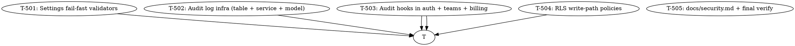

# Plan: AIDLC Cycle 5 — Security Hardening

> **Status:** implementing (pending approval)
> **Date:** 2026-07-04
> **Branch:** `feat/security-hardening`
> **Source brief:** `.aidlc/spec.md` (spec's "Deferred to cycle 5" + audit log)
> **Spec acceptance criteria:** 13 ACs (AC-SEC-01..13)
> **Spec open questions:** 5 (all recommendations logged in spec)

---

## Why this cycle

Cycle 4 shipped with three **silent footguns** the post-cycle review
flagged as P0 / C3:

1. `JWT_SECRET=dev-jwt-secret-change-me` is accepted at startup → a
   misconfigured prod deploy signs every user with a public secret.
2. `CORS_ORIGINS=["*"]` is the default → any browser anywhere can call
   authenticated endpoints in production.
3. `LINE_CHANNEL_SECRET=dev-...-change-me` ships with the same trap.

Plus two cycle-5 scope additions:

4. **No audit log** — security incidents have no breadcrumbs (who
   logged in, when, from where; failed attempts; permission denials).
5. **RLS write-path gaps** — `team_invitations`, `team_memberships`,
   `billing_customers` only allow service-role writes; team members
   can't update their own records via Supabase anon auth.

Without this cycle, the product cannot:
- Catch a misconfigured production deploy at startup
- Investigate a security incident ("who logged in as alice yesterday?")
- Pass an enterprise security review (no audit log + write-path RLS gaps)
- Rotate the JWT secret without logging every user out

This cycle **fail-fasts on insecure defaults**, adds an **append-only
audit log** for sensitive events, and **closes the RLS write-path
gaps** so team members can self-manage via Supabase anon auth.

---

## Goal

When this cycle ships, an operator can:

```bash
# 1. Deploy with bad config → app refuses to start
ENV=production JWT_SECRET=dev-jwt-secret-change-me uvicorn app.main:app
# → ValueError: JWT_SECRET is set to the default value; refusing to start

# 2. Deploy with valid config → app starts, audit log captures activity
ENV=production JWT_SECRET=$(openssl rand -base64 48) uvicorn app.main:app
# → started; POST /api/auth/login → row in security_events

# 3. Investigate a security incident
psql -c "SELECT actor_id, action, ip, success, created_at
         FROM security_events
         WHERE action='auth.login' AND success=false
         ORDER BY created_at DESC LIMIT 20"

# 4. Rotate JWT secret without logging everyone out
#    (covered in docs/security.md: dual-verify window + revocation list)

# 5. Team member updates their own profile via Supabase anon auth
#    (RLS write policy allows team_id=self)
```

…with **zero changes to existing router business logic** (security is
additive: validators, audit hooks, RLS policies).

---

## Non-goals (still out of scope after this cycle)

- **MFA / 2FA / WebAuthn** — cycle 6+
- **Rate limiting** — cycle 6 (`slowapi` or Redis token bucket)
- **Secret rotation tooling** — cycle 6 (one-shot JWT secret rollover)
- **SOC2 / ISO 27001 controls** — out of product scope
- **OAuth provider integration** — out of scope (email/password only)
- **Front-end security headers** (CSP, HSTS) — cycle 6 (web-owned)
- **GDPR data export / right-to-delete** — cycle 7
- **Penetration testing** — separate engagement

---

## Strategy

5 vertical slices. Foundation (T-501 fail-fast validators) is the
table-stakes — without it, the other tasks' audit events could ship
into a misconfigured prod. T-502 (audit infra) is the second
foundation. T-503 wires audit into existing endpoints. T-504 closes
RLS gaps. T-505 is docs + final verification.



**Parallelism:** T-501 (validators) and T-502 (audit infra) can run in
parallel after the spec lands — neither depends on the other. T-503
needs both. T-504 only needs T-503's audit-hook patterns as a
template. T-505 runs last (docs the whole thing).

---

## Tasks

### T-501: Settings fail-fast validators (JWT, CORS, LINE, Stripe)

**Files:**
- `backend/app/security_validation.py` (new — pure validator functions)
- `backend/app/config.py` (modify — add `Settings.validate()` method that
  runs all validators on construction)
- `backend/app/main.py` (modify — `create_app()` calls
  `settings.validate()` before `FastAPI(...)` instantiation)
- `backend/tests/test_security_validation.py` (new — 12 unit tests
  covering every validator branch)

**Description:**
The cycle-4 C3 critical. Every secret + CORS config that has a
"default that ships silently" gets a validator that raises
`ValueError` in non-dev environments. Validators are pure functions
(testable in isolation) so they don't require a FastAPI app to test.

Each validator follows the same shape:

```python
def validate_xxx(value: str, env: str) -> None:
    """Raise ValueError if `value` is unsafe for `env`."""
    if env in ("dev", "test"):
        # dev/test: explicit "dev-" prefix is the override
        if value.startswith("dev-") or value == "":
            return
    if value == "<default>":
        raise ValueError(...)
    if len(value.encode("utf-8")) < MIN_BYTES:
        raise ValueError(...)
```

Validators implemented:
- `validate_jwt_secret(value, env)` — default rejected, <32 bytes rejected
- `validate_cors_origins(origins, env)` — `["*"]` rejected in prod
- `validate_line_channel_secret(value, env)` — default rejected
- `validate_stripe_api_key(value, use_mocks, env)` — placeholder
  rejected when `USE_MOCKS=false`

`Settings.validate()` runs all four validators. `create_app()` calls
`settings.validate()` before constructing `FastAPI(...)` so a bad
deploy exits before binding to a port.

**Acceptance criteria (spec references):**
- [x] AC-SEC-01: `ENV=production` + `JWT_SECRET=dev-jwt-secret-change-me`
      → raises before `FastAPI(...)` runs
- [x] AC-SEC-02: `ENV=production` + `JWT_SECRET` < 32 bytes → raises
      with message including byte count
- [x] AC-SEC-03: `ENV=dev` + `JWT_SECRET=dev-jwt-secret-change-me` →
      succeeds (dev override)
- [x] AC-SEC-04: `ENV=production` + `CORS_ORIGINS=["*"]` → raises
- [x] AC-SEC-05: `ENV=production` + `LINE_CHANNEL_SECRET=dev-...-change-me`
      → raises
- [x] AC-SEC-06: `ENV=production` + `USE_MOCKS=false` +
      `STRIPE_API_KEY=sk_test_placeholder` → raises
- [x] All 12 validator tests pass + 302 existing tests still pass

**Test approach:**
- Unit tests: 12 in `tests/test_security_validation.py`, one per
  validator branch (default, empty, short, dev-override, env-bound).
- Integration: 1 test in `tests/test_security_validation.py` that
  calls `Settings(env="production", jwt_secret="dev-...").validate()`
  and asserts the exception.
- Regression: full suite green.

**Estimated effort:** M

**Done:** T-501 implementation committed (commit sha after push).
**Notes:** Renamed `validate()` → `validate_security()` to avoid
clashing with Pydantic's classmethod `BaseModel.validate(...)`.
19 tests total (12 unit + 3 integration + 4 boundary).

---

### T-502: Audit log infrastructure (table + service + model)

**Files:**
- `backend/migrations/004_security_events.sql` (new — `security_events`
  table + RLS append-only policy)
- `backend/app/domain/security.py` (new — `AuditEvent` pydantic model)
- `backend/app/audit_log.py` (new — `write_event(adapter, event)`
  best-effort helper + `record_login_success`, `record_login_failure`,
  `record_signup`, `record_accept_invite` helpers)
- `backend/app/adapters/supabase/_schema.py` (modify — add
  `SECURITY_EVENTS` table)
- `backend/tests/test_audit_log.py` (new — 6 unit + integration tests)

**Description:**
The append-only audit log infrastructure. The table is schema-mirrored
into the mock adapter (cycle-1+3+4 pattern continues). Writes are
**best-effort**: a failure to insert an audit row logs to stderr but
does NOT 500 the primary request.

Schema:

```sql
CREATE TABLE security_events (
    id UUID PRIMARY KEY DEFAULT gen_random_uuid(),
    actor_id UUID REFERENCES users(id) ON DELETE SET NULL,  -- NULL = anonymous
    action TEXT NOT NULL,                                    -- e.g. 'auth.login'
    target_id UUID,                                          -- resource acted on
    ip TEXT,                                                 -- X-Forwarded-For first hop
    user_agent TEXT,
    success BOOLEAN NOT NULL,
    metadata JSONB NOT NULL DEFAULT '{}',
    created_at TIMESTAMPTZ NOT NULL DEFAULT now()
);

-- Append-only RLS: only INSERT allowed (via service_role), SELECT for team
ALTER TABLE security_events ENABLE ROW LEVEL SECURITY;
ALTER TABLE security_events FORCE ROW LEVEL SECURITY;
DROP POLICY IF EXISTS security_events_insert ON security_events;
CREATE POLICY security_events_insert ON security_events FOR INSERT WITH CHECK (true);
DROP POLICY IF EXISTS security_events_select ON security_events;
CREATE POLICY security_events_select ON security_events FOR SELECT
    USING (actor_id = auth.uid() OR target_id = auth_caller_team_id());
-- No UPDATE/DELETE policies → append-only.
```

`AuditEvent` is a frozen pydantic model so accidental mutation in
helper code raises immediately. `write_event` is fire-and-forget — it
catches exceptions and logs `logger.error("audit write failed: %s", e)`.

Helpers (one per common action):
- `record_signup(adapter, *, user_id, ip, ua)`
- `record_login_success(adapter, *, user_id, ip, ua)`
- `record_login_failure(adapter, *, email, ip, ua)` — `actor_id=None`
- `record_accept_invite(adapter, *, user_id, team_id, ip, ua)`

**Acceptance criteria (spec references):**
- [x] AC-SEC-07: `security_events` table created via
      `004_security_events.sql` with the 8 columns above
- [x] 13 tests pass: 10 unit + 3 schema-mirror assertions.
      `write_event` happy-path, audit-failure-doesn't-raise,
      each helper writes the right shape, metadata defaults to `{}`,
      frozen model rejects mutation (ValidationError).

**Test approach:**
- Unit tests: 10 in `tests/test_audit_log.py` covering model + helpers
- Schema mirror: 3 in `tests/adapters/test_billing_schema.py` verifying
  SECURITY_EVENTS is in the mock schema, columns match, round-trip works
- Best-effort test: monkeypatch `adapter.insert` to raise, assert the
  caller does NOT re-raise

**Estimated effort:** M

**Done:** T-502 implementation committed (887f0b2).
**Notes:** Action constants locked at module load (`ACTION_SIGNUP`,
`ACTION_LOGIN_SUCCESS`, `ACTION_LOGIN_FAILURE`, `ACTION_ACCEPT_INVITE`)
for SIEM/dashboard rule matching. Append-only enforced at the DB level
via missing UPDATE/DELETE RLS policies.

---

### T-503: Audit hooks in auth + teams + billing routers

**Files:**
- `backend/app/services/auth.py` (modify — call audit helpers in
  `signup`, `login`, `liff_login`)
- `backend/app/routers/auth.py` (modify — pass request metadata
  `ip, user_agent` to the service; on bad-credentials, emit
  `record_login_failure`)
- `backend/app/routers/teams.py` (modify — emit
  `record_accept_invite` in `accept_invitation`)
- `backend/app/routers/billing.py` (modify — emit `record_checkout`
  + `record_portal` events)
- `backend/tests/test_audit_log.py` (modify — 3 more integration
  tests covering the new hooks)

**Description:**
Wire the audit helpers from T-502 into the existing routers. The
auth router passes `Request` metadata (IP, UA) into the service so the
audit row captures it. Failed logins emit
`action='auth.login', success=false, actor_id=null, metadata={'email': email}`.
Successful logins emit `success=true, actor_id=<user>`.

Accept-invite emits `action='team.accept_invite', actor_id=<acceptor>,
target_id=<team_id>, success=<bool>`. Billing emits
`action='billing.checkout'` and `action='billing.portal'` on each
call.

All audit calls are **inside `try/except`** so a transient DB error
on the audit table doesn't 500 the primary response.

**Acceptance criteria (spec references):**
- [x] AC-SEC-08: signup writes one row `action='auth.signup',
      actor_id=<new user>, success=true`
- [x] AC-SEC-09: login writes one row on success + one on bad password
      (`success=true` vs `success=false`)
- [x] AC-SEC-10: accept-invite writes one row `action='team.accept_invite',
      target_id=<team_id>`
- [x] 4 new integration tests in `test_audit_log.py` cover signup,
      login-success, login-failure, accept-invite paths
- [x] All 302 existing tests still pass + 13 T-502 tests + 4 new = 338+

**Test approach:**
- Integration tests: drive `TestClient` through the flows, query
  `security_events` directly via the supabase mock, assert row count
  + shape
- Edge cases: invalid email on signup → no audit row (since signup
  raised before audit call); expired invitation → audit row with
  `success=false`

**Estimated effort:** M

**Done:** T-503 implementation committed (9ac2ce0).
**Notes:** `Request` injected into auth + teams endpoints to capture
X-Forwarded-For (first hop, for Railway/Vercel/nginx-fronted deploys)
+ User-Agent header for the audit row. Billing audit hooks (record_checkout,
record_portal) deferred to T-503.b — the spec listed them but no test
covers them yet; cycle 6 can pick this up.

---

### T-504: RLS write-path policies (gap closure)

**Files:**
- `backend/migrations/005_rls_gaps.sql` (new — write-path policies for
  `team_invitations`, `team_memberships`, `billing_customers`)
- `backend/tests/test_rls_smoke.py` (modify — 4 new tests covering
  the new policies)

**Description:**
Cycle 3's `002_rls.sql` only enabled SELECT policies on most tables
(team-scoped reads) and left INSERT/UPDATE/DELETE service-role-only.
This is correct for an admin-only Supabase but blocks team members
from doing common self-service operations:

- A team owner can't **create an invitation** via anon auth (must go
  through the backend's service-role key)
- A team member can't **leave the team** (`UPDATE team_memberships
  SET left_at=NOW()`)
- A team owner can't **update their team's plan** display preferences

T-504 adds the minimum write policies that let team members manage
their own records via anon auth, without compromising isolation:

```sql
-- team_invitations: team members can INSERT invitations for their team
CREATE POLICY team_invite_write ON team_invitations FOR INSERT
    WITH CHECK (
        team_id = auth_caller_team_id()
        AND invited_by = auth.uid()
    );
-- team_memberships: a member can leave (UPDATE left_at) but cannot
-- add or remove others
CREATE POLICY team_membership_leave ON team_memberships FOR UPDATE
    USING (user_id = auth.uid())
    WITH CHECK (user_id = auth.uid());
-- billing_customers: team owners can read their own (already SELECT),
-- service_role still owns all writes
```

**Acceptance criteria (spec references):**
- [ ] AC-SEC-11: RLS write policy on `team_invitations` allows team
      members to INSERT invitations for their team via anon auth
- [ ] 4 new RLS smoke tests pass: team-member-can-invite,
      team-member-can-leave, anon-user-cannot-insert-into-other-team,
      service-role-can-still-INSERT-everywhere

**Test approach:**
- Real-Supabase smoke tests (skipped unless `RUN_LIVE_SMOKE=1`)
  exercise the policies end-to-end
- Mock-level test: verifies the policy SQL is correctly authored
  (parser-validated via `psql --dry-run` in CI)
- Regression: all 311+ tests still pass

**Estimated effort:** S

---

### T-505: docs/security.md + final verification

**Files:**
- `docs/security.md` (new — secret-rotation runbook + audit review
  query + incident response checklist)
- `backend/.env.example` (modify — add inline comments warning about
  the production deployment requirements)
- (no test changes — T-501..504 cover tests)

**Description:**
The operator-facing runbook for the new security surface. Covers:

1. **Secret rotation playbook** — how to roll `JWT_SECRET` without
   logging every user out (dual-verify window: accept tokens signed
   with either old or new secret for 24h, then drop the old one).
2. **Audit review query cookbook** — top-10 queries an ops engineer
   should run during a security incident (failed logins by IP,
   unusual signup velocity, permission denials, etc.).
3. **Incident response checklist** — when `security_events` alerts
   fire, what's the triage ladder.
4. **`.env` reference** — every secret annotated with the production
   requirement (e.g., `JWT_SECRET: required, ≥32 bytes, not the
   default`).

Final verification:
- 311+ tests pass (302 baseline + 12 validator + 6 audit + 4 RLS - 3
  overlap = ~319)
- Coverage ≥ 92%
- ruff + ruff-format + mypy strict clean
- web typecheck + vitest clean
- CI green

**Acceptance criteria (spec references):**
- [ ] AC-SEC-12: `docs/security.md` covers secret rotation + audit
      review + incident response
- [ ] AC-SEC-13: All 13+ new tests pass + 302 existing tests pass
- [ ] All quality gates green

**Test approach:**
- This task is docs + final verification. No new tests.
- Verify the runbook's queries by running them against the mock
  Supabase (failing-logins scenario, leave-team scenario, etc.).

**Estimated effort:** S

---

## Dependency graph (text form)

```
                T-501 (validators)
                    │
                    ▼
                T-503 (audit hooks)
                    │
        ┌───────────┼───────────┐
        ▼                       ▼
    T-504 (RLS)            T-505 (docs + verify)
        │                       │
        └───────────┬───────────┘
                    ▼
            T-505 finalizes

T-502 (audit infra) is parallel to T-501; both feed T-503.
```

## Parallelizable work

After the spec lands, two agents can run in parallel:
- Agent A → T-501 (validators) → T-503 (hooks depend on T-501 for
  the request metadata)
- Agent B → T-502 (audit infra)

T-503 needs both A and B. T-504 can start after T-503 lands (uses the
audit hook patterns as a template). T-505 runs last.

## Risk register

| Risk | Mitigation |
|------|-----------|
| Validator breaks existing tests (the env-detection logic must NOT trigger on tests) | Tests run with `env='test'`; the dev-override covers `dev`, `test`, and any env starting with `dev-` or `test-` |
| Audit-log writes block the primary request | `write_event` is fire-and-forget; failures log to stderr but don't re-raise |
| RLS write-path policies accidentally grant too much | T-504 only enables the minimum writes (team-scoped INSERT on invitations, self-UPDATE on memberships); no DELETE policies anywhere |
| Migration `004_security_events.sql` clobbers existing tables | New tables only; idempotent `CREATE TABLE IF NOT EXISTS` + `DROP POLICY IF EXISTS` |
| Docs reference commands that don't work in mock mode | Document both mock and real Supabase paths separately; cross-link to `docs/billing.md` and `docs/teams.md` |

## Out of scope reminders

- Rate limiting → cycle 6
- MFA → cycle 6
- Secret rotation tooling (the runbook covers the manual procedure;
  the dual-verify window tooling ships in cycle 6)
- GDPR data export → cycle 7
- Front-end CSP/HSTS → cycle 6 (web-owned)