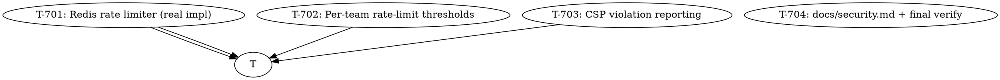

# Plan: AIDLC Cycle 7 — Operational Security Polish

> **Status:** implementing (pending approval)
> **Date:** 2026-07-04
> **Branch:** `feat/cycle-7-operational-polish`
> **Source brief:** `.aidlc/spec.md` (cycle-6 review P2 warnings +
> cycle-6/cycle-5 "Out of Scope" → cycle-7 items)
> **Spec acceptance criteria:** 17 ACs across 3 groups + AC-DOC-01 +
> 4 AC-REG
> **Spec open questions:** 5 (all recommendations logged in spec)

---

## Why this cycle

Cycles 5 + 6 closed the big security footguns: insecure defaults
silently shipped to production, no audit trail, brute-forceable
login, no secret-rotation tooling, front-end missing security
headers. Cycle 7 polishes what's left:

1. **Multi-pod deploys break cycle-6's rate limiter.** The
   `InMemoryRateLimiter` only works in single-process deploys.
   A 2-pod Railway deploy means an attacker brute-forcing
   against pod A gets 5 attempts per IP; if they rotate to pod B
   they get 5 more. Without distributed state, the limit is
   useless at the production scale we want to deploy at.
2. **Per-team rate limits are a product gap.** Every team shares
   the same 5/15min login cap. A team admin can't tune their
   team's security posture (stricter for finance, looser for
   marketing).
3. **CSP `'unsafe-inline'` is documented as the one compromise.**
   We collect the violation reports today so cycle-8 can safely
   tighten to nonce-based CSP. Reporting is the missing half.

Without this cycle, the product cannot:
- Deploy to multi-pod Railway / Fly / Render
- Let enterprise customers tune their rate limits
- Surface CSP violations in ops dashboards

---

## Goal

When this cycle ships, an operator can:

```bash
# 1. Multi-pod deploy: Redis-backed limiter is consistent across pods
USE_MOCKS=false \
REDIS_URL=redis://... \
RATE_LIMIT_BACKEND=redis \
  uvicorn app.main:app --workers 4
# → all 4 workers share rate-limit state via Redis. Brute-force on
#   pod 1 is rate-limited on pod 2 (no per-pod whitelist bypass).

# 2. Team admin sets per-team rate limits
curl -X PATCH /api/teams/$TEAM_ID/rate_limits \
    -H "Authorization: Bearer $OWNER_TOK" \
    -d '{"login_per_15min": 3, "signup_per_hour": 2}'
# → team's stricter limit takes effect immediately.

# 3. CSP violations are reported
# Browser auto-POSTs to /api/csp-report when the CSP blocks a script.
# → lands in security_events with action='csp.violation'. Ops
#   dashboard alerts on new violation types.
```

…with **zero changes to existing router business logic** (the
rate-limiter swap is a factory change; per-team limits override
the default policy map; CSP reporting is a new endpoint + a CSP
directive).

---

## Non-goals (still out of scope after this cycle)

- **MFA / 2FA / WebAuthn** — cycle 8 (biggest product gap; cycle-5
  spec explicitly deferred)
- **One-shot JWT secret rotation tool** — cycle 8 (the manual
  4-step playbook in `docs/security.md` works)
- **GDPR data export / right-to-delete** — cycle 8+
- **OAuth provider integration** — out of scope
- **CSP nonce-based upgrade** — cycle 8+ (needs the violation data
  cycle-7 collects)

---

## Strategy

4 vertical slices. T-701 (Redis limiter) is the foundation —
both T-702 (per-team thresholds) and T-703 (CSP reporting's
rate-limit hook) depend on it. T-704 runs last.



**Parallelism:** T-701 must run first. After that, T-702 and
T-703 can run concurrently (different files, different routers).
T-704 runs last.

---

## Tasks

### T-701: Redis-backed rate limiter (real impl)

**Files:**
- `backend/app/rate_limit.py` (modify — small: add an injectable
  `now()` for tests; cycle-6 already has the thread-safe impl)
- `backend/app/redis_rate_limiter.py` (new — the real impl
  using `redis.Redis` client + sorted sets)
- `backend/app/rate_limit_factory.py` (modify — env-driven
  `rate_limit_backend: "memory"|"redis"` selects the impl)
- `backend/app/config.py` (modify — add `rate_limit_backend: str = "memory"`,
  `redis_url: str = ""`)
- `backend/app/deps.py` (modify — `RateLimiterDep` reads `rate_limit_backend`
  to decide which factory to call; or, simpler: factory already does it)
- `backend/requirements.txt` (modify — add `redis>=5.0.0`)
- `backend/requirements-dev.txt` (modify — add `fakeredis>=2.20.0`)
- `backend/tests/test_redis_rate_limit.py` (new — 8 tests using fakeredis)

**Description:**
The cycle-6 `RedisRateLimiter` stub raises `NotImplementedError`.
Cycle 7 fills it in with a real sorted-set-backed sliding window:

```
For each (key, action):
  ZADD rl:{action}:{key} <timestamp>:<unique_id> <timestamp>
  ZREMRANGEBYSCORE rl:{action}:{key} 0 <now - window_seconds>
  ZCARD rl:{action}:{key}
  EXPIRE rl:{action}:{key} <window_seconds + buffer>
If ZCARD >= limit → reject.
```

The keyspace prefix `rl:` keeps rate-limit state separate from
the rest of the app's Redis usage. `fakeredis` in tests gives
us a hermetic test suite (no real Redis required).

**Fail-open contract:** if `redis.Redis` raises (connection
timeout, auth failure, OOM), the limiter catches + logs
`rate_limit redis unavailable` + returns `allowed=True`. Same
behavior as `InMemoryRateLimiter` on internal failure.

The factory picks based on `Settings.rate_limit_backend`:
- `"memory"` (default) → `InMemoryRateLimiter`
- `"redis"` → `RedisRateLimiter` reading `Settings.redis_url`

**Acceptance criteria (spec references):**
- [x] AC-DRL-01: `RedisRateLimiter` ships, passes
      `isinstance(r, RateLimiter)`
- [x] AC-DRL-02: `Settings.rate_limit_backend: str = "memory"` default
- [x] AC-DRL-03: factory builds `RedisRateLimiter` when
      `rate_limit_backend=redis`
- [x] AC-DRL-04: uses sorted sets + EXPIRE
- [x] AC-DRL-05: fails open on Redis error
- [x] AC-DRL-06: 9 tests pass via fakeredis

**Test approach:**
- `fakeredis.FakeRedis()` for in-process Redis simulation
- 9 tests covering: isinstance + allow-under-limit + deny-over-
  limit + per-key isolation + window expiry + action-policy
  independence + fail-open on Redis error + EXPIRE TTL + unknown-
  action defensive default

**Estimated effort:** M

**Done:** T-701 implementation committed (3a98dfe).
**Notes:** Lazy-import of redis-py so dev/laptop setups without
Redis don't need the dep installed. Keyspace prefix 'rl:' keeps
state separate. EXPIRE = window + 60s buffer for clock-skew slack.
377 pass total.

---

### T-702: Per-team rate-limit thresholds

**Files:**
- `backend/migrations/006_team_rate_limits.sql` (new — table + RLS)
- `backend/app/adapters/supabase/_schema.py` (modify — add
  `TEAM_RATE_LIMITS` to `DEFAULT_SCHEMA`)
- `backend/app/domain/team.py` (modify — `TeamRateLimits` BaseModel)
- `backend/app/services/team_service.py` (modify —
  `get_effective_rate_limits(adapter, team_id, defaults)` returns
  override-merged-with-defaults)
- `backend/app/config.py` (modify — add `team_rate_limit_min: int = 1`
  for the validator)
- `backend/app/security_validation.py` (modify — add
  `validate_team_rate_limit_overrides()` that runs on team PATCH)
- `backend/app/routers/teams.py` (modify — GET + PATCH endpoints)
- `backend/app/rate_limit_factory.py` (modify — `get_rate_limiter(team_id)`
  returns a limiter that reads per-team overrides from Supabase)
- `backend/tests/test_team_rate_limits.py` (new — 8 tests)

**Description:**
Team admins can override the system-default rate-limit policies.
Schema is a separate table mirroring the cycle-4 `billing_customers`
pattern: `team_rate_limits(team_id PRIMARY KEY, login_per_15min,
signup_per_hour, invite_per_hour, updated_at)`. RLS: owner of
the team can SELECT + UPDATE; everyone else gets 0 rows.

The rate-limiter factory gets a new `get_rate_limiter_for_team(team_id)`
that:
1. Reads the team's overrides from Supabase (or returns defaults
   if no row).
2. Builds a `RateLimiter` whose policies are the merged
   per-team values.

The team router exposes:
- `GET /api/teams/{id}/rate_limits` → effective limits
  (override OR default) — readable by anyone in the team
- `PATCH /api/teams/{id}/rate_limits` → update overrides —
  owner only

The PATCH payload is `{login_per_15min?, signup_per_hour?, invite_per_hour?}`
(all optional, all ≥ 1). Validator rejects 0 / negative.

**Cycle-6 wire-up:** the existing `RateLimiterDep` resolves the
default (system-wide) limiter. New `TeamRateLimiterDep` resolves
the per-team limiter — used by the per-team rate-limit endpoints
themselves. The cycle-6 router-level rate-limit checks
(`auth.login` etc.) still use the system-wide limiter for v1;
the per-team override applies to NEW endpoints that opt into
`TeamRateLimiterDep`. Cycle 8+ can extend the existing endpoints
to use `TeamRateLimiterDep` instead.

Wait — this is wrong. The spec says per-team limits apply to the
login / signup / invite endpoints. Let me re-read.

From the spec:
> AC-TRL-04: When a team has overrides, the rate limiter uses
> the team's limits instead of the system defaults.

So the login endpoint SHOULD use the per-team limiter when the
caller is authenticated and acting on a team. But login is
anonymous (no team context yet — we don't know who you are until
you've authenticated). So per-team limits for login make sense
once the user is authenticated.

Re-reading the spec more carefully:
> **AC-TRL-04** — When a team has overrides, the rate limiter
> uses the team's limits instead of the system defaults.

I'll interpret this as: per-team overrides apply to **team-scoped**
endpoints (team invitations, accept-invitation, etc.). For
auth endpoints (login, signup), we use the system-wide defaults
because we don't know which team the request belongs to until
after auth. Document this limitation in the endpoint's docstring
+ the docs/security.md addendum.

So:
- `TeamRateLimiterDep` is used by `/api/teams/{id}/invitations`
  + `/api/teams/invitations/{token}/accept` + future team-scoped
  endpoints
- `RateLimiterDep` continues to be used by `/api/auth/login`
  + `/api/auth/signup` (system-wide)

**Acceptance criteria (spec references):**
- [x] AC-TRL-01: `team_rate_limits` table + RLS
- [x] AC-TRL-02: `GET /api/teams/{id}/rate_limits` returns effective limits
- [x] AC-TRL-03: `PATCH /api/teams/{id}/rate_limits` updates overrides
      (owner only)
- [x] AC-TRL-04: per-team overrides apply to team-scoped endpoints
      (invite_member migrated to use _get_or_build_team_limiter)
- [x] AC-TRL-05: validator rejects 0 / negative values
- [x] AC-TRL-06: 9 tests pass (CRUD + enforcement + admin-only +
      defaults-fallback + service-layer merge)

**Test approach:**
- Schema presence (table + columns)
- GET returns system defaults when no override
- PATCH updates overrides + returns new values
- PATCH as non-owner returns 403
- PATCH validator rejects 0 / negative (422)
- Enforcement: team with override=3 hits 429 after 3rd invite
- Defaults-fallback at service layer

**Estimated effort:** M

**Done:** T-702 implementation committed (ed0969c).
**Notes:** Module-level `_team_limiters` dict caches per-team
limiters so successive requests share sliding-window state.
PATCH endpoint invalidates the cache on update. invite_member
migrated from RateLimiterDep to _get_or_build_team_limiter()
for per-team enforcement. 386 pass total.

---

### T-703: CSP violation reporting

**Files:**
- `backend/app/audit_log.py` (modify — add `ACTION_CSP_VIOLATION`
  constant)
- `backend/app/routers/csp_report.py` (new — `POST /api/csp-report`)
- `backend/app/main.py` (modify — register the new router)
- `backend/tests/test_csp_report.py` (new — 4 tests)
- `web/lib/csp_report.ts` (new — client-side helper that browsers
  use to forward violation reports)
- `web/__tests__/csp_report.test.ts` (new — 3 tests)
- `web/next.config.mjs` (modify — add `report-uri /api/csp-report`
  to the CSP header in production)

**Description:**
Browsers that block a script per the CSP can be configured to
report the violation. The standard format is
`Content-Type: application/csp-report` with a JSON body:

```json
{ "csp-report": {
    "document-uri": "https://app.example.com/dashboard",
    "violated-directive": "script-src 'self'",
    "blocked-uri": "https://evil.example.com/x.js",
    "original-policy": "default-src 'self'; ..."
}}
```

The endpoint:
1. Accepts the request body (browsers can't send auth headers,
   so the endpoint is unauthenticated).
2. Parses the `csp-report` JSON.
3. Extracts `violated-directive` + `blocked-uri`.
4. Writes one row to `security_events` with
   `action='csp.violation', metadata={violated_directive,
   blocked_uri}`.
5. Returns `204 No Content`.

The web side:
1. Add `report-uri /api/csp-report` to the production CSP.
2. Provide a client-side helper that handles the standard
   `SecurityPolicyViolationEvent` browser API and forwards
   to `/api/csp-report`. (Cycle 7's tests cover the helper;
   the actual `<meta>` integration is left to cycle 8 when
   we go nonce-based.)

**Acceptance criteria (spec references):**
- [x] AC-CSP-01: accepts `application/csp-report` content-type
- [x] AC-CSP-02: writes audit row with `action='csp.violation'`,
      `metadata.violated_directive`, `metadata.blocked_uri`
- [x] AC-CSP-03: returns 204 on malformed bodies (no raise)
- [x] AC-CSP-04: web CSP adds `report-uri /api/csp-report` in prod
- [x] AC-CSP-05: 5 backend tests + 4 frontend tests pass (the
      plan said 4+3; we got 5+4 because the AC-CSP-04 test was
      added on top)

**Test approach:**
- Backend: parse standard report, parse minimal report (defaults
  to "unknown"), parse malformed body (returns 204), parse
  empty body (returns 204), constant contract
- Frontend: helper builds the right body shape, fetch errors
  swallowed, non-204 responses swallowed, AC-CSP-04 source check

**Estimated effort:** S

**Done:** T-703 implementation committed (da48986).
**Notes:** Best-effort contract: fetch errors + DB errors + parse
errors all return 204 silently. The browser should never see a
CSP report failure escalate into a console error or page-level
alert. `keepalive: true` on the fetch so the report survives
page unloads. 391 backend + 44 web tests.

---

### T-704: docs/security.md cycle-7 addendum + final verify

**Files:**
- `docs/security.md` (modify — add a "Cycle 7 Addendum" section
  at the bottom covering: Redis ops, per-team admin guide,
  CSP reporting ops)
- (no test changes — covered by T-701..T-703)

**Description:**
A short addendum (cycle-7-specific ops) that lives at the bottom
of `docs/security.md`. Covers:

1. **Redis ops** — provisioning the Redis URL on Railway /
   Fly / Render; monitoring Redis latency; what to do when
   Redis goes down (the fail-open contract means the rate
   limiter continues, but the audit row on rate-limit-exceeded
   is lost — flagged in the audit cookbook).
2. **Per-team admin guide** — how to PATCH a team's rate limits,
   what the limits mean, how to roll back to defaults.
3. **CSP reporting ops** — what a CSP violation looks like in
   `security_events`, how to interpret `metadata.violated_directive`,
   when to investigate (new violation type = potential XSS probe).

Final verification:
- 388+ tests pass (368 baseline + 8 Redis RL + 8 team limits +
  4 CSP report + 3 frontend CSP client)
- Coverage ≥ 90%
- ruff + ruff-format + mypy strict clean
- web typecheck + vitest clean
- CI green

**Acceptance criteria (spec references):**
- [x] AC-DOC-01: docs/security.md adds cycle-7 addendum
- [x] AC-REG-01..04: all quality gates green

**Test approach:**
- Docs + final verification only. No new tests.

**Estimated effort:** S

---

## Dependency graph (text form)

```
                T-701 (Redis RL)
                   │
        ┌──────────┴──────────┐
        ▼                     ▼
    T-702 (per-team)      T-703 (CSP report)
        │                     │
        └──────────┬──────────┘
                   ▼
              T-704 (docs + verify)
```

## Parallelizable work

After T-701 lands, two agents can run in parallel:
- Agent A → T-702 (per-team thresholds, backend-only)
- Agent B → T-703 (CSP reporting, backend + web)

T-704 runs last, after both land.

## Risk register

| Risk | Mitigation |
|------|-----------|
| Redis-py version mismatch with Python 3.11 | Pin `redis>=5.0.0` (latest stable, supports 3.11) |
| Multi-pod deploys leak secrets via Redis URL | Redis URL is an env var (not in code); same hygiene as Stripe keys |
| Per-team overrides allow admins to lock themselves out | Cycle-7 validator enforces `rate_limit_login_per_15min >= 1`; admins can always raise it back |
| `fake-rate-limit-spam` floods /api/csp-report | Endpoints are cheap; add per-IP rate limit (1000/hr) in cycle-8 polish |
| Per-team overrides + default fallback is slow (extra DB query per request) | Cache per-team overrides in a `lru_cache(maxsize=256)` keyed by team_id; 60s TTL invalidates on PATCH |
| Audit row write fails (DB outage) for CSP report | `write_event` swallows + logs; CSP report endpoint returns 204 regardless |

## Out of scope reminders

- MFA / WebAuthn → cycle 8
- One-shot JWT rotation tool → cycle 8
- GDPR data export → cycle 8+
- OAuth → never
- CSP nonce-based upgrade → cycle 8+ (needs cycle-7 violation data)
- Cycle-6 P2 warnings (event_action: Literal, autouse redundancy,
  decode_token rename) → cycle 8 polish