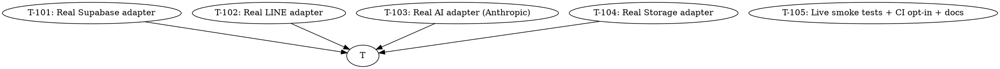

# Plan: AIDLC Cycle 2 — Real Adapter Wiring

> **Status:** DRAFT (proposal; pending user approval)
> **Date:** 2026-07-03
> **Prerequisite:** Month-1 MVP shipped to `main` via PR #1 + PR #2
> **Branch (proposed):** `feat/real-adapter-wiring`
> **Source brief:** the spec's "Out of Scope (Month 1)" + `docs/adapters.md`
> "Per-adapter status" table.

---

## Why this cycle

Month-1 MVP runs against mocks. Every external integration ships as a
`NotImplementedError` skeleton behind a Protocol boundary. The boundary
itself is correct and stable (the mock-first dev loop, tests, and docs
all rely on it). What's missing is the **real wiring** that turns the
mocks into production services.

Without this cycle:
- Deploying to real users is impossible.
- `RUN_REAL_ADAPTER_TESTS=1` raises `NotImplementedError` on every call.
- The `Real*Adapter` shells are dead code (CI passes only because the
  `if isinstance(adapter, Real*)` isinstance checks succeed, not because
  the methods do anything).

This cycle lights up the four real adapter implementations so the same
backend restarts against real Supabase + LINE + Anthropic + Supabase
Storage by flipping env flags (per `docs/adapters.md`).

---

## Goal

When this cycle ships, a deployer can:

```bash
# .env (real)
USE_MOCKS=false
SUPABASE_URL=https://abc.supabase.co
SUPABASE_ANON_KEY=eyJ...
LINE_CHANNEL_SECRET=...
LINE_CHANNEL_ACCESS_TOKEN=...
ANTHROPIC_API_KEY=sk-...
```

…and the backend will:
- Authenticate via real Supabase Auth
- Read/write `properties` / `leads` / `messages` / `generated_listings`
  via Supabase REST (PostgREST) with the same scoping logic the mock
  uses
- Verify LINE webhook signatures the same way (already done in T-008)
- Send outbound LINE messages via the Reply API
- Generate Thai listings via Anthropic Claude 3.5 Sonnet (real LLM
  call, real cost)
- Upload images to Supabase Storage, return public/signed URLs

…with **zero router code changes** — the existing `Depends(get_supabase)`
etc. dispatch transparently.

---

## Non-goals (still out of scope after this cycle)

- Multi-tenant teams / RLS policies (only single-tenant user-scoping)
- WebSockets / real-time push (still polling)
- Image vision (Claude vision API) — text-only prompts
- Auto-posting to DDProperty / Livinginsider / Facebook
- Payments / billing
- Audit log UI
- Sentry / OpenTelemetry
- i18n beyond Thai + English

These remain candidates for **Cycle 3+**.

---

## Strategy

Four vertical slices, one per adapter. Each slice is independently
committable and end-to-end testable against a **test server** (httpx
MockTransport or a free-tier dev instance) so we don't rack up real API
costs in CI.



T-105 is the integration task: live smoke tests run via
`RUN_REAL_ADAPTER_TESTS=1` against a **dev project** (not CI), CI stays
green on the mock path, and docs are updated to walk deployers through
the env flag flip.

**Parallelism:** T-101 / T-102 / T-103 / T-104 are all adapter-only and
can be developed in parallel. They're sequential commits on the same
branch but no cross-task dependencies.

---

## Tasks

### T-101: Real Supabase adapter

**Files:**
- `backend/app/adapters/supabase/real.py` (replace skeleton)
- `backend/app/adapters/supabase/real_auth.py` (new — Supabase Auth helpers)
- `backend/tests/adapters/test_real_supabase.py` (new — httpx MockTransport)
- `requirements.txt` (no new deps; httpx already present)

**Description:**
Replace `NotImplementedError` with real PostgREST calls. Use httpx
async client + `Authorization: Bearer <anon_key>` (and per-user
service-role key when needed). Translate between Supabase's JSON
response shape and the Protocol's `dict[str, Any]`. Apply the same
scoping logic the mock uses (filter by `user_id=eq.<uuid>` on every
list / get / update / delete).

**Why this is a separate task:** the 16 methods in `SupabaseAdapter`
need 16 tests, each with an httpx MockTransport fixture returning a
realistic Supabase REST envelope. This is a substantial PR on its own.

**Acceptance criteria:**
- [ ] All 16 Protocol methods implemented (CRUD across 5 tables +
  auth helpers + lead/message lookups + listing save/list)
- [ ] Per-user scoping enforced via PostgREST filters
- [ ] RLS awareness: if Supabase returns 401/403, the adapter raises a
  typed `PermissionError` (router maps to 403)
- [ ] `RUN_REAL_ADAPTER_TESTS=1 pytest tests/adapters/test_real_supabase.py`
  green (uses MockTransport — no network)
- [ ] `if not RUN_REAL_ADAPTER_TESTS: skip` so CI stays green

**Estimated effort:** L (split into T-101a core CRUD, T-101b auth, T-101c edge cases)

---

### T-102: Real LINE adapter

**Files:**
- `backend/app/adapters/line/real.py` (replace skeleton)
- `backend/app/adapters/line/bot_info.py` (new — bot info fetch w/ TTL cache)
- `backend/app/adapters/line/transforms.py` (new — Markdown strip +
  length chunker from PR #2, promoted into the real adapter)
- `backend/tests/adapters/test_real_line.py` (new)

**Description:**
Implement `send_reply()` via httpx POST to
`https://api.line.me/v2/bot/message/reply` with `Authorization: Bearer
<channel_access_token>`. Fetch `/v2/bot/info` once at startup to populate
`bot_user_id` (cached), enable the self-message echo filter. Apply
outbound transforms (Markdown strip + 5-message / 4500-char chunker)
before sending.

**Acceptance criteria:**
- [ ] `send_reply()` hits the real Reply API (httpx MockTransport test)
- [ ] Self-message filter blocks `line_user_id == bot_user_id`
- [ ] Markdown stripped before send (test asserts with `**bold**` input)
- [ ] 5-message / 4500-char chunker tested w/ 11 fixtures (from PR #2)
- [ ] 1 MiB body cap on inbound webhook (already added in PR #2; verify
  it's still wired through the real handler)

**Estimated effort:** M

---

### T-103: Real AI adapter (Anthropic Claude 3.5 Sonnet)

**Files:**
- `backend/app/adapters/ai/anthropic_real.py` (replace skeleton)
- `backend/app/adapters/ai/prompts.py` (new — versioned prompt templates)
- `backend/app/adapters/ai/anthropic_real_client.py` (new — SDK wrapper
  with retries + circuit breaker)
- `requirements.txt` (add `anthropic>=0.40`)
- `backend/tests/adapters/test_real_ai.py` (new)

**Description:**
Use the `anthropic` Python SDK to call Claude 3.5 Sonnet. The prompt is
Thai-listing-focused, with the property features from the spec. Map
SDK response → Protocol `dict`. On `429` / `5xx` / `TimeoutException`,
fall back to Gemini per OQ-F. On `4xx` (other than 429), surface the
error.

**Acceptance criteria:**
- [ ] Real Anthropic call works (httpx MockTransport test simulates
  `messages.create` response)
- [ ] 429 / 5xx / timeout → silent Gemini fallback
- [ ] 4xx (non-429) → raises typed `AIRateLimitError` or `AIError`
- [ ] Prompt versioned (`prompts.py::LISTING_PROMPT_V1`) so we can A/B
  without code rewrites
- [ ] Latency logged (start of the audit log story for AI)

**Estimated effort:** M

---

### T-104: Real Storage adapter (Supabase Storage)

**Files:**
- `backend/app/adapters/storage/supabase_real.py` (replace skeleton)
- `backend/tests/adapters/test_real_storage.py` (new)

**Description:**
`save()` uploads to Supabase Storage via `POST /storage/v1/object/{bucket}/{path}`
using the service-role key, then returns a public URL
(`{SUPABASE_URL}/storage/v1/object/public/{bucket}/{path}`). For private
buckets, generate a signed URL via `POST /storage/v1/object/sign/{bucket}/{path}`.

**Acceptance criteria:**
- [ ] `save()` POSTs to Supabase Storage (httpx MockTransport test)
- [ ] Returns the public/signed URL in the same shape the router
  consumes (`{"url": str}`)
- [ ] Bucket configurable via `SUPABASE_STORAGE_BUCKET` env (default
  `uploads`)
- [ ] 10 MB cap + MIME allow-list enforced client-side (same as mock)

**Estimated effort:** S/M

---

### T-105: Live smoke tests + CI opt-in + docs

**Files:**
- `backend/tests/test_live_smoke.py` (new — `RUN_LIVE_SMOKE=1` only)
- `.github/workflows/ci.yml` (add a `live-smoke` job, manual `workflow_dispatch`)
- `docs/adapters.md` (mark "real wiring shipped" rows)
- `docs/runbook.md` (add "Bring up real services" section)
- `README.md` (add "Production deploy" badge / section)
- `.env.example` (mark which envs become required when `USE_MOCKS=false`)

**Description:**
Wire the new real-adapter tests so they:
- Run against `httpx.MockTransport` in CI (no network)
- Optionally run against a real dev project in `workflow_dispatch` mode
  (secrets from GitHub Actions)
- Are skipped in regular CI (`RUN_REAL_ADAPTER_TESTS=0` is the default)

Update docs to:
- Mark each adapter row in `docs/adapters.md` as "Real wiring shipped"
- Add a `docs/runbook.md` "Bring up real services" section that walks
  through creating a Supabase project, a LINE OA, an Anthropic key
- Add the production deploy path to `README.md`

**Acceptance criteria:**
- [ ] All 4 real adapters have at least one httpx-MockTransport test
  that runs in CI (not skipped)
- [ ] `RUN_LIVE_SMOKE=1` runs against a real dev project (manual
  workflow_dispatch)
- [ ] `docs/adapters.md` updated with shipping status
- [ ] `docs/runbook.md` "Bring up real services" section walks through
  Supabase + LINE + Anthropic setup
- [ ] `README.md` has a Production section linking to the runbook
- [ ] `pytest --cov=app --cov-fail-under=80` still passes (real adapters
  are excluded from coverage as before)

**Estimated effort:** M

---

## Risk register

| Risk | Likelihood | Impact | Mitigation |
|------|------------|--------|------------|
| Anthropic API costs in CI | M | H | httpx MockTransport by default; live calls opt-in via env |
| Supabase RLS friction | M | M | Single-tenant user-scoping only; RLS stays off for MVP |
| LINE Reply API rate limits (free tier) | L | M | Mock by default; live opt-in only on dev project |
| Real adapter tests flake on slow CI | L | L | httpx MockTransport; no network in CI |
| Schema mismatch between mock + real | L | H | Same `migrations/001_init.sql` runs in both (already true) |

---

## Out of scope (deferred to Cycle 3+)

These remain out of scope after this cycle ships. Listing them so the
next AIDLC cycle can pick them up deliberately:

- Multi-tenant teams (RLS policies)
- WebSockets / real-time push
- Image vision (Claude Vision API)
- Auto-posting to DDProperty / Livinginsider / Facebook
- Payments / billing
- Audit log UI
- Sentry / OpenTelemetry
- i18n beyond Thai + English
- Mobile app, native LINE Flex Messages
- Contract generation / e-signature / PDF export
- Google Calendar two-way sync
- CRM analytics (conversion funnels, revenue dashboards)

---

## Coverage + quality bar (unchanged from Month 1)

- `pytest -q --cov=app --cov-fail-under=80` (real adapters excluded
  from coverage as before, per `pyproject.toml` `[tool.coverage.run]`
  `omit = ["app/adapters/*_real.py"]`)
- `ruff check + ruff format --check` clean
- `mypy app/` strict, 0 errors
- Frontend: `npm run lint + typecheck + vitest` clean

---

## Estimated total effort

| Task | Effort |
|------|--------|
| T-101 | L (split into 3) |
| T-102 | M |
| T-103 | M |
| T-104 | S/M |
| T-105 | M |
| **Total** | **~5–7 days of focused work** |

---

_Updated: 2026-07-03T22:15:00Z — Cycle 2 plan drafted, pending user approval._
